  

<h1>Starfield Technologies, LLC 
Mark Certificate 
Certificate Policy and 
Certification Practice Statement (CP/CPS)</h1>

**Version 1.2**  
**Date: August 26, 2026**

## Table of Contents

| Section | Title |
|---|---|
| 1 | INTRODUCTION |
| 1.1 | Overview |
| 1.2 | Document Name and Identification |
| 1.2.1 | Document History |
| 1.3 | PKI Participants |
| 1.3.1 | Certification Authorities |
| 1.3.2 | Registration Authorities |
| 1.3.3 | Subscribers |
| 1.3.4 | Relying Parties |
| 1.3.5 | Other Participants |
| 1.4 | Certificate Usage |
| 1.4.1 | Appropriate Certificate Uses |
| 1.4.2 | Prohibited Certificate Uses |
| 1.5 | Policy Administration |
| 1.5.1 | Organization Administering the Document |
| 1.5.2 | Contact Person |
| 1.5.3 | Person Determining CP/CPS Suitability for the Policy |
| 1.5.4 | CP/CPS Approval Procedure |
| 1.6 | Definitions, Acronyms, and References |
| 1.6.1 | Definitions and Acronyms |
| 1.6.2 | References |
| 1.6.3 | Conventions |
| 2 | PUBLICATION AND REPOSITORY RESPONSIBILITIES |
| 2.1 | Repositories |
| 2.2 | Publication of Certification Information |
| 2.3 | Time or Frequency of Publication |
| 2.4 | Access Controls on Repositories |
| 3 | IDENTIFICATION AND AUTHENTICATION |
| 3.1 | Naming |
| 3.1.1 | Types of Names |
| 3.1.2 | Need for Names to be Meaningful |
| 3.1.3 | Anonymity or Pseudonymity of Subscribers |
| 3.1.4 | Rules for Interpreting Various Name Forms |
| 3.1.5 | Uniqueness of Names |
| 3.1.6 | Recognition, Authentication and Role of Trademarks |
| 3.2 | Initial Identity Validation |
| 3.2.1 | Method to Prove Possession of Private Key |
| 3.2.2 | Authentication of Organization and Domain Identity |
| 3.2.3 | Criteria for Interoperation |
| 3.3 | Identification and Authentication for Re-key Requests |
| 3.3.1 | Identification and Authentication for Routine Re-key |
| 3.3.2 | Identification and Authentication for Re-key After Revocation |
| 3.4 | Identification and Authentication for Revocation Request |
| 4 | CERTIFICATE LIFE-CYCLE OPERATIONAL REQUIREMENTS |
| 4.1 | Certificate Application |
| 4.1.1 | Who Can Submit a Certificate Application |
| 4.1.2 | Enrollment Process and Responsibilities |
| 4.2 | Certificate Application Processing |
| 4.2.1 | Performing Identification and Authentication Functions |
| 4.2.2 | Approval or Rejection of Certificate Applications |
| 4.2.3 | Notification to Subscriber by the CA of Issuance of Certificate |
| 4.3 | Certificate Issuance |
| 4.3.1 | CA Actions During Certificate Issuance |
| 4.3.2 | Notification to Subscriber by the CA of Issuance of Certificate |
| 4.4 | Certificate Acceptance |
| 4.4.1 | Conduct Constituting Certificate Acceptance |
| 4.4.2 | Publication of the Certificate by the CA |
| 4.4.3 | Notification of Certificate Issuance by the CA to Other Entities |
| 4.5 | Key Pair and Certificate Usage |
| 4.5.1 | Subscriber Private Key and Certificate Usage |
| 4.5.2 | Relying Party Public Key and Certificate Usage |
| 4.6 | Certificate Renewal |
| 4.6.1 | Circumstance for Certificate Renewal |
| 4.6.2 | Who May Request Renewal |
| 4.6.3 | Processing Certificate Renewal Requests |
| 4.6.4 | Notification of New Certificate Issuance to Subscriber |
| 4.6.5 | Conduct Constituting Acceptance of a Renewal Certificate |
| 4.6.6 | Publication of the Renewal Certificate by the CA |
| 4.6.7 | Notification of Certificate Issuance by the CA to Other Entities |
| 4.7 | Certificate Re-key |
| 4.7.1 | Circumstance for Certificate Re-key |
| 4.7.2 | Who May Request Certification of a New Public Key |
| 4.7.3 | Processing Certificate Re-keying Requests |
| 4.7.4 | Notification of New Certificate Issuance to Subscriber |
| 4.7.5 | Conduct Constituting Acceptance of a Re-keyed Certificate |
| 4.7.6 | Publication of the Re-keyed Certificate by the CA |
| 4.7.7 | Notification of Certificate Issuance by the CA to Other Entities |
| 4.8 | Certificate Modification |
| 4.8.1 | Circumstance for Certificate Modification |
| 4.8.2 | Who May Request Certificate Modification |
| 4.8.3 | Processing Certificate Modification Requests |
| 4.8.4 | Notification of New Certificate Issuance to Subscriber |
| 4.8.5 | Conduct Constituting Acceptance of Modified Certificate |
| 4.8.6 | Publication of the Modified Certificate by the CA |
| 4.8.7 | Notification of Certificate Issuance by the CA to Other Entities |
| 4.9 | Certificate Revocation and Suspension |
| 4.9.1 | Circumstances for Revocation |
| 4.9.1.1 | Reasons for Revoking a Subscriber Certificate |
| 4.9.1.2 | Reasons for Revoking a Subordinate CA Certificate |
| 4.9.2 | Who Can Request Revocation |
| 4.9.3 | Procedure for Revocation Request |
| 4.9.4 | Revocation Request Grace Period |
| 4.9.5 | Time Within Which CA Must Process the Revocation Request |
| 4.9.6 | Revocation Checking Requirement for Relying Parties |
| 4.9.7 | CRL Issuance Frequency |
| 4.9.8 | Maximum Latency for CRLs (if applicable) |
| 4.9.9 | On-line Revocation/Status Checking Availability |
| 4.9.10 | On-line Revocation Checking Requirements |
| 4.9.11 | Other Forms of Revocation Advertisements Available |
| 4.9.12 | Special Requirements Regarding Key Compromise |
| 4.9.13 | Circumstances for Suspension |
| 4.9.14 | Who Can Request Suspension |
| 4.9.15 | Procedure for Suspension Request |
| 4.9.16 | Limits on Suspension Period |
| 4.10 | Certificate Status Services |
| 4.10.1 | Operational Characteristics |
| 4.10.2 | Service Availability |
| 4.10.3 | Optional Features |
| 4.11 | End of Subscription |
| 4.12 | Key Escrow and Recovery |
| 4.12.1 | Key Escrow and Recovery Policy and Practices |
| 4.12.2 | Session Key Encapsulation and Recovery Policy and Practices |
| 5 | FACILITY, MANAGEMENT, AND OPERATIONAL CONTROLS |
| 5.1 | Physical Controls |
| 5.1.1 | Site Location and Construction |
| 5.1.2 | Physical Access |
| 5.1.3 | Power and Air Conditioning |
| 5.1.4 | Water Exposures |
| 5.1.5 | Fire Prevention and Protection |
| 5.1.6 | Media Storage |
| 5.1.7 | Waste Disposal |
| 5.1.8 | Offsite Backup |
| 5.2 | Procedural Controls |
| 5.2.1 | Trusted Roles |
| 5.2.2 | Number of Persons Required Per Task |
| 5.2.3 | Identification and Authentication for Each Role |
| 5.2.4 | Roles Requiring Separation of Duties |
| 5.3 | Personnel Controls |
| 5.3.1 | Qualifications, Experience, and Clearance Requirements |
| 5.3.2 | Background Check Procedures |
| 5.3.3 | Training Requirements |
| 5.3.4 | Retraining Frequency and Requirements |
| 5.3.5 | Job Rotation Frequency and Sequence |
| 5.3.6 | Sanctions for Unauthorized Actions |
| 5.3.7 | Independent Contractor Requirements |
| 5.4 | Audit Logging Procedures |
| 5.4.1 | Types of Events Recorded |
| 5.4.2 | Frequency of Processing Log |
| 5.4.3 | Retention Period for Audit Log |
| 5.4.4 | Protection of Audit Log |
| 5.4.5 | Audit Log Backup Procedures |
| 5.4.6 | Audit Collection System (Internal vs. External) |
| 5.4.7 | Notification to Event-Causing Subject |
| 5.4.8 | Vulnerability Assessments |
| 5.5 | Records Archival |
| 5.5.1 | Types of Records Archived |
| 5.5.2 | Retention Period for Archive |
| 5.5.3 | Protection of Archive |
| 5.5.4 | Archive Backup Procedures |
| 5.5.5 | Requirements for Time-Stamping of Records |
| 5.5.6 | Archive Collection System (Internal or External) |
| 5.5.7 | Procedures to Obtain and Verify Archive Information |
| 5.6 | Key Changeover |
| 5.7 | Compromise and Disaster Recovery |
| 5.7.1 | Incident and Compromise Handling Procedures |
| 5.7.2 | Computing Resources, Software, and/or Data are Corrupted |
| 5.7.3 | Entity Private Key Compromise Procedures |
| 5.7.4 | Business Continuity Capabilities After a Disaster |
| 5.8 | CA or RA Termination |
| 6 | TECHNICAL SECURITY CONTROLS |
| 6.1 | Key Pair Generation and Installation |
| 6.1.1 | Key Pair Generation |
| 6.1.2 | Private Key Delivery to Subscriber |
| 6.1.3 | Public Key Delivery to Certificate Issuer |
| 6.1.4 | CA Public Key Delivery to Relying Parties |
| 6.1.5 | Key Sizes |
| 6.1.6 | Public Key Parameters Generation and Quality Checking |
| 6.1.7 | Key Usage Purposes |
| 6.2 | Private Key Protection and Cryptographic Module Engineering Controls |
| 6.2.1 | Cryptographic Module Standards and Controls |
| 6.2.2 | Private Key Multi-Person Control |
| 6.2.3 | Private Key Escrow |
| 6.2.4 | Private Key Backup |
| 6.2.5 | Private Key Archival |
| 6.2.6 | Private Key Transfer Into or From a Cryptographic Module |
| 6.2.7 | Private Key Storage on Cryptographic Module |
| 6.2.8 | Method of Activating Private Keys |
| 6.2.9 | Method of Deactivating Private Key |
| 6.2.10 | Method of Destroying Private Key |
| 6.2.11 | Cryptographic Module Rating |
| 6.3 | Other Aspects of Key Pair Management |
| 6.3.1 | Public Key Archival |
| 6.3.2 | Certificate Operational Periods and Key Pair Usage Periods |
| 6.4 | Activation Data |
| 6.4.1 | Activation Data Generation and Installation |
| 6.4.2 | Activation Data Protection |
| 6.4.3 | Other Aspects of Activation Data |
| 6.5 | Computer Security Controls |
| 6.5.1 | Specific Computer Security Technical Requirements |
| 6.5.2 | Computer Security Rating |
| 6.6 | Life Cycle Technical Controls |
| 6.6.1 | System Development Controls |
| 6.6.2 | Security Management Controls |
| 6.6.3 | Life Cycle Security Controls |
| 6.7 | Network Security Controls |
| 6.8 | Time-Stamping |
| 7 | CERTIFICATE, CRL, AND OCSP PROFILES |
| 7.1 | Certificate Profile |
| 7.1.1 | Version Number |
| 7.1.2 | Certificate Extensions |
| 7.1.3 | Algorithm Object Identifiers |
| 7.1.4 | Name Forms |
| 7.1.5 | Name Constraints |
| 7.1.6 | Certificate Policy Object Identifier |
| 7.1.7 | Usage of Policy Constraints Extension |
| 7.1.8 | Policy Qualifier Syntax and Semantics |
| 7.1.9 | Processing Semantics for the Critical Certificate Policies Extension |
| 7.2 | CRL Profile |
| 7.2.1 | Version Number |
| 7.2.2 | CRL and CRL Entry Extensions |
| 7.3 | OCSP Profile |
| 7.3.1 | Version Number |
| 7.3.2 | OCSP Extensions |
| 8 | COMPLIANCE AUDIT AND OTHER ASSESSMENTS |
| 8.1 | Frequency or Circumstances of Assessment |
| 8.2 | Identity/Qualifications of Assessor |
| 8.3 | Assessor's Relationship to Assessed Entity |
| 8.4 | Topics Covered by Assessment |
| 8.5 | Actions Taken as a Result of Deficiency |
| 8.6 | Communication of Results |
| 8.7 | Self-Audits |
| 8.8 | Specification Administration |
| 8.8.1 | Specification Change Procedures |
| 8.8.2 | Publication and Notification Policies |
| 8.9 | CP/CPS Approval Procedures |
| 9 | OTHER BUSINESS AND LEGAL MATTERS |
| 9.1 | Fees |
| 9.1.1 | Certificate Issuance or Renewal Fees |
| 9.1.2 | Certificate Access Fees |
| 9.1.3 | Revocation or Status Information Access Fees |
| 9.1.4 | Fees for Other Services |
| 9.1.5 | Refund Policy |
| 9.2 | Financial Responsibility |
| 9.2.2 | Other Assets |
| 9.2.3 | Insurance or Warranty Coverage for End-entities |
| 9.3 | Confidentiality of Business Information |
| 9.3.1 | Scope of Confidential Information |
| 9.3.2 | Information not Within the Scope of Confidential Information |
| 9.3.3 | Responsibility to Protect Confidential Information |
| 9.4 | Privacy of Personal Information |
| 9.4.1 | Privacy Plan |
| 9.4.2 | Information Treated as Private |
| 9.4.3 | Information Not Deemed Private |
| 9.4.4 | Responsibility to Protect Private Information |
| 9.4.5 | Notice and Consent to Use Private Information |
| 9.4.6 | Disclosure Pursuant to Judicial or Administrative Process |
| 9.4.7 | Other Information Disclosure Circumstances |
| 9.5 | Intellectual Property Rights |
| 9.5.1 | Property Rights in Certificates and Revocation Information |
| 9.5.2 | Property Rights in the Agreement |
| 9.5.3 | Property Rights to Names |
| 9.5.4 | Property Rights in Keys and Key Material |
| 9.6 | Representations and Warranties |
| 9.6.1 | CA Representations and Warranties |
| 9.6.2 | RA Representations and Warranties |
| 9.6.3 | Subscriber Representations and Warranties |
| 9.6.4 | Relying Party Representations and Warranties |
| 9.6.5 | Representations and Warranties of Other Participants |
| 9.7 | Disclaimers of Warranties |
| 9.7.1 | Fiduciary Relationships |
| 9.8 | Limitations of Liability |
| 9.9 | Indemnities |
| 9.9.1 | Indemnification by Starfield |
| 9.9.2 | Indemnification by Subscribers |
| 9.9.3 | Indemnification by Relying Parties |
| 9.10 | Term and Termination |
| 9.10.1 | Term |
| 9.10.2 | Termination |
| 9.10.3 | Effect of Termination and Survival |
| 9.11 | Individual Notices and Communications with Participants |
| 9.12 | Amendments |
| 9.12.1 | Procedure for Amendment |
| 9.12.2 | Notification Mechanism and Period |
| 9.12.3 | Circumstances Under Which OID Must Be Changed |
| 9.13 | Dispute Resolution Provisions |
| 9.14 | Governing Law |
| 9.15 | Compliance with Applicable Law |
| 9.16 | Miscellaneous Provisions |
| 9.16.1 | Entire Agreement |
| 9.16.2 | Assignment |
| 9.16.3 | Severability |
| 9.16.4 | Enforcement |
| 9.16.5 | Force Majeure |
| 9.17 | Other Provisions |
| 10 | APPENDIX A – CERTIFICATE PROFILES |
| 10.1 | Root CAs |
| 10.1.1 | GoDaddy Verified Mark Root CA - VMCR1 |
| 10.2 | Issuing CAs |
| 10.2.1 | Issuing (Subordinate) CA |
| 10.3 | End Entity Mark Certificates |
| 10.3.1 | GoDaddy Verified Mark Intermediate CA - VMCR1V1: Subscriber Certificates |

## 1 INTRODUCTION

Starfield Technologies is an innovator in the field of Internet foundation services, providing advanced software and Internet solutions critical to the building of online presence and e-commerce.

The Starfield Public Key Infrastructure ("Starfield PKI") has been established to provide a variety of digital certificate services.

### 1.1 Overview

This Certificate Policy and Certification Practice Statement (CP/CPS) is the authoritative document describing Starfield’s PKI practices for the issuance and management of Mark Certificates.

Starfield’s practices for the issuance and management of Mark Certificates are governed in accordance with the Minimum Security Guidelines for Issuance of Mark Certificates ("MC Requirements"). These requirements are available at <https://bimigroup.org/supporting-documents/>. Users can find the MC Terms of Use ("MC Terms") in Section 9.6.3 of this document.

The Starfield PKI conforms to the current version of the Minimum Security Requirements for Issuance of Mark Certificates for the Issuance and Management of Mark Certificates. In the event of any inconsistency between this document and those Requirements, those Requirements take precedence over this document.

In addition, Starfield attests that it adheres to the latest published versions of the following policies and program requirements:

- CCADB Policy – <https://www.ccadb.org/policy>
- Apple Root Certificate Program – <https://www.apple.com/certificateauthority/ca_program.html>

This CP/CPS is structured according to the common outline set forth in RFC 3647, divided into nine primary components that cover the
security controls and practices and procedures for certificate issuance services within Starfield. To preserve the outline specified by
RFC 3647, section headings that do not apply have the statement "Not applicable" or "No stipulation."

### 1.2 Document Name and Identification

This document has been approved for publication by the Starfield Governance and Policy Committee (GPC) as of the date indicated at the top of the file.

The OID-arcs associated with this document is **2.16.840.1.114413.1.7.23.4**.

#### 1.2.1 Document History

| Version | Effective Date | Change Summary |
| --- | --- | --- |
| 1.0 | 2026-04-28 | Initial Draft |
| 1.1 | 2026-07-31 | Updated the following sections: 3.2.2.7.1.2, 9  |
| 1.2 | 2026-08-26 | Updated the Definitions, Acronyms, and References section to include definitions for BIMI and Mark Certificate Guidelines  |

### 1.3 PKI Participants

#### 1.3.1 Certification Authorities

Starfield Certification Authorities (CAs) perform the following general functions:

- Create and sign certificates
- Distribute certificates to the appropriate Subscribers and Relying Parties
- Revoke certificates
- Distribute certificate status information in the form of Certificate Revocation Lists (CRLs) or other mechanisms
- Provide a repository where certificates and certificate status information are stored and made available (if applicable).

Obligations of the CAs within the Starfield PKI include:

- Generating, issuing, and distributing certificates
- Distributing CA certificates
- Generating and publishing certificate status information (such as CRLs)
- Maintaining the security, availability, and continuity of the certificate issuance and CRL signing functions
- Providing a means for Subscribers to request revocation
- Revoking certificates
- Periodically demonstrating internal or external audited compliance with this CP/CPS.

Within the Starfield PKI, there are two general types of CAs: Root and Issuing CAs. Currently, the Starfield PKI hierarchy for Mark Certificates consists of the CAs in the diagram below. Relationships between these CA certificates are represented in the following diagram:

# Certificate Hierarchies

The figure below shows the GoDaddy Verified Mark CA hierarchy used for Mark Certificates (VMCR1).

### GoDaddy Verified Mark hierarchy

source: [diagrams/GoDaddy_VerifiedMark_Hierarchy.mmd](diagrams/GoDaddy_VerifiedMark_Hierarchy.mmd)

#### 1.3.2 Registration Authorities

Registration Authorities (RAs) evaluate and either approve or reject Subscriber certificate management transactions, including certificate applications, renewals, re-key requests, and revocation requests for Mark Certificates.

The RA performs identity and authorization validation for Subscribers requesting Mark Certificates in accordance with this CP/CPS and the Minimum Security Requirements for Issuance of Mark Certificates.

Obligations of the Registration Authorities include:

- Receiving and processing Mark Certificate applications from Subscribers.
- Obtaining the Subscriber’s public key for inclusion in the certificate.
- Identifying and authenticating Subscribers in accordance with this CP/CPS.
- Verifying that the Subscriber possesses the private key corresponding to the public key submitted for certification.
- Verifying the Subscriber’s authorization to use the mark represented in the certificate.
- Validating the mark image and associated information submitted in the certificate request, including verification that the mark image conforms to applicable technical requirements.
- Performing validation procedures appropriate to the Mark Certificate type, including:
  - verification that the mark is a registered trademark issued by a recognized trademark office for Verified Mark Certificates (VMCs); and
  - validation of prior-use marks or modified registered trademarks for Common Mark Certificates (CMCs).
- Verifying that the Subscriber controls or is authorized to use the domain(s) associated with the Mark Certificate.
- Receiving, authenticating, and processing certificate revocation requests.
- Maintaining records of validation activities.
- Providing suitable training to personnel performing RA functions.

For Mark Certificates issued under this CP/CPS, the RA function is performed by Starfield using a combination of automated systems and trained validation personnel.

#### 1.3.3 Subscribers

For the Root CAs, the Subscribers include subordinate CAs. For Starfield Issuing CAs, Subscribers typically include organizations and individuals. In some situations, Starfield may act as an Applicant or Subscriber, for instance, when it generates and protects a Private Key, requests a Certificate, demonstrates control of a Domain, or obtains a Certificate for its own use.

Obligations of Subscribers within the Starfield PKI include:

- Providing information to the RA that is accurate and complete to the best of the Subscribers' knowledge and belief regarding information in their certificates and identification and authentication information
- Taking appropriate measures to protect their private keys from compromise
- Promptly reporting loss or compromise of private key(s) and inaccuracy of certificate information
- Using its key pair(s) in compliance with this CP/CPS.

#### 1.3.4 Relying Parties

Relying Parties include any entity that relies upon a Starfield Mark Certificate to validate the authenticity of a mark associated with an email sender and to determine whether the mark may be displayed in accordance with applicable requirements. Relying Parties may include mailbox providers, email clients, and other systems that evaluate Mark Certificates.

Obligations of Relying Parties within the Starfield PKI include:

- Confirming the validity of Subscriber Mark certificates
- Verifying the digital signature associated with the Mark Certificate.
- Using the public-key in the Subscriber's certificate in compliance with this CP/CPS.

#### 1.3.5 Other Participants

Not applicable.

### 1.4 Certificate Usage

#### 1.4.1 Appropriate Certificate Uses

A certificate issued by Starfield shall be used only as designated by the terms of this CP/CPS and any service agreements. However, the sensitivity of the information processed or protected by a Certificate varies greatly, and each Relying Party must evaluate the associated risks before deciding on whether to rely on a Certificate issued under this CP/CPS.

#### 1.4.2 Prohibited Certificate Uses

As defined in the applicable Subscriber Agreement.

### 1.5 Policy Administration

#### 1.5.1 Organization Administering the Document

This CP/CPS is administered by the Starfield GPC.

#### 1.5.2 Contact Person

Starfield Technologies, LLC  
100 S Mill Ave, Suite 1600  
Tempe, AZ 85281  
Phone: 480-505-8800  
E-mail: practices@starfieldtech.com

In case of a Certificate Problem Report, that concerns a key compromised certificate, a misissued certificate, or any other type of suspicious activity with a certificate, contact us at (480) 505-8852, or practices@starfieldtech.com.

The Starfield GPC consists of representatives from executive management, corporate security, PKI operations, and legal.

Obligations of the Starfield GPC include:

- Approving and maintaining this CP/CPS
- Interpreting adherence to this CP/CPS
- Specifying the content of public-key certificates
- Resolving or causing resolution of disputes related to this CP/CPS
- Remaining current regarding security threats and ensuring that appropriate actions are taken to counteract significant threats.

#### 1.5.3 Person Determining CP/CPS Suitability for the Policy

The Starfield GPC determines the suitability of a CP/CPS for the policy based on the results of independent audits.

#### 1.5.4 CP/CPS Approval Procedure

All changes to this document are approved by a quorum of The Starfield GPC.

### 1.6 Definitions, Acronyms, and References

#### 1.6.1 Definitions and Acronyms

| Term | Acronym | Definition |
| --- | --- | --- |
| Affiliate |  | A corporation, partnership, joint venture or other entity controlling, controlled by, or under common control with another entity, or an agency, department, political subdivision, or any entity operating under the direct control of a Government Entity. |
| American Institute of Certified Public Accountants | AICPA | American Institute of Certified Public Accountants |
| Applicant |  | The natural person or legal entity that applies for (or seeks renewal of) a Certificate. Once the Certificate issues, the Applicant is referred to as the Subscriber. |
| Applicant Representative |  | A natural person or human sponsor who is either the Applicant, employed by the Applicant, or an authorized agent who has express authority to represent the Applicant: I. who signs and submits, or approves a certificate request on behalf of the Applicant, and/or II. who signs and submits a Subscriber Agreement on behalf of the Applicant, and/or III. who acknowledges the Terms of Use on behalf of the Applicant when the Applicant is an Affiliate of the CA or is the CA. |
| Application‐Layer Protocol Negotiation | ALPN | A TLS Extension that includes the protocol negotiation within the exchange of hello messages. |
| Application Software Supplier |  | A supplier of Internet browser software or other relying‐party application software that displays or uses Certificates and incorporates Root Certificates. |
| Attestation Letter |  | A letter attesting that Subject Information is correct written by an accountant, lawyer, government official, or other reliable third party customarily relied upon for such information. |
| Audit Period |  | In a period-of-time audit, the period between the first day (start) and the last day of operations (end) covered by the auditors in their engagement. (This is not the same as the period of time when the auditors are on-site at the CA.) The coverage rules and maximum length of audit periods are defined in Section 8.1 Frequency or Circumstances of Assessment |
| Audit Report |  | A report from a Qualified Auditor stating the Qualified Auditor's opinion on whether an entity's processes and controls comply with the mandatory provisions of these Requirements. |
| Authorization Domain Name | ADN | The FQDN used to obtain authorization for a given FQDN to be included in a Certificate. The CA may use the FQDN returned from a DNS CNAME lookup as the FQDN for the purposes of domain validation. If a Wildcard Domain Name is to be included in a Certificate, then the CA MUST remove “*.” from the left-most portion of the Wildcard Domain Name to yield the corresponding FQDN. The CA may prune zero or more Domain Labels of the FQDN from left to right until encountering a Base Domain Name and may use any one of the values that were yielded by pruning (including the Base Domain Name itself) for the purpose of domain validation. |
| Authorized Port |  | One of the following ports: 80 (http), 443 (http), 115 (sftp), 25 (smtp), 22 (ssh). |
| Base Domain Name |  | The portion of an applied‐for FQDN that is the first Domain Name node left of a registry-controlled or public suffix plus the registry‐controlled or public suffix. (e.g. "example.co.uk" or "example.com"). For FQDNs where the right‐most Domain Name node is a gTLD having ICANN Specification 13 in its registry agreement, the gTLD itself may be used as the Base Domain Name. |
| BIMI (Brand Indicators for Message Identification) | BIMI | An email standard specified by the AuthIndicators Working Group (AuthIndicators WG) that enables participating email services to display a brand-controlled logo in association with authenticated email messages. |
| Certificate Authority Authorization | CAA | From RFC 8659: “The Certification Authority Authorization (CAA) DNS Resource Record allows a DNS domain name holder to specify one or more Certification Authorities (CAs) authorized to issue certificates for that domain name. CAA Resource Records allow a public CA to implement additional controls to reduce the risk of unintended certificate mis-issue.” |
| CA Key Pair |  | A Key Pair where the Public Key appears as the Subject Public Key Info in one or more Root CA Certificate(s) and/or Subordinate CA Certificate(s). |
| Certificate |  | An electronic document that uses a digital signature to bind a public key and an identity. |
| Certificate Data |  | Certificate requests and data related thereto (whether obtained from the Applicant or otherwise) in the CA's possession or control or to which the CA has access. |
| Certificate Management Process |  | Processes, practices, and procedures associated with the use of keys, software, and hardware, by which the CA verifies Certificate Data, issues Certificates, maintains a Repository, and revokes Certificates. |
| Certificate Policy | CP | A set of rules that indicates the applicability of a named Certificate to a particular community and/or PKI implementation with common security requirements. |
| Certificate Problem Report |  | Complaint of suspected Key Compromise, Certificate misuse, or other types of fraud, compromise, misuse, or inappropriate conduct related to Certificates. |
| Certificate Profile |  | A set of documents or files that defines requirements for Certificate content and Certificate extensions, e.g. a Section in a CA's CPS or a certificate template file used by CA software. |
| Certificate Revocation List | CRL | A regularly updated time-stamped list of revoked Certificates that is created and digitally signed by the CA that issued the Certificates. |
| Certificate Signing Request | CSR | A message sent to the certification authority containing the information required to issue a digital certificate. |
| Certification Authority | CA | Certificate Issuing entity defined further in Section 1.3.1 Certificate Authorities of this document. |
| Certification Practice Statement | CPS | One of several documents forming the governance framework in which Certificates are created, issued, managed, and used. |
| Canonical Name | CNAME | A DNS resource record to provide the canonical name associated with an alias name further defined in RFC 2181 Section 10.1. |
| Code Signing Certificate |  | A certificate issued to an organization for the purpose of digitally signing software. |
| Compromise |  | A loss, theft, disclosure, modification, unauthorized use, or other breach of security related to a Private Key. |
| Country |  | Either a member of the United Nations OR a geographic region recognized as a Sovereign State by at least two UN member nations. |
| Country code top-level domain | ccTLD | An internet top level domain reserved for a country or dependent territory. |
| Combined Mark |  | A mark consisting of a graphic design, stylized logo, or image, with words and/or letters having a particular stylized appearance. For greater certainty, a “Combined Mark” includes marks made up of both word and design elements. |
| Common Mark Certificate | CMC | A Mark Certificate that contains a Mark Representation that has not been verified as a Registered Mark or Government Mark. |
| Cross Certificate |  | A certificate that is used to establish a trust relationship between two Root CAs. |
| Custom Certificate |  | A certificate profile defined for a specific, non-standard usage. |
| Delegated Third Party |  | A natural person or Legal Entity that is not the CA but is authorized by the CA, and whose activities are not within the scope of the appropriate CA audits, to assist in the Certificate Management Process by performing or fulfilling one or more of the CA requirements found herein. |
| Design Mark |  | A mark consisting of a graphic design, stylized logo, or image, without words and/or letters. For greater certainty, a “Design Mark” includes marks made up solely of design elements. |
| Designated Individual |  | The person who completes the F2F Verification Procedure under the provisions of the MC Requirements. |
| Distinguished Name | DN | A globally unique identifier representing a Subscriber. |
| Doing Business As | DBA | An entity name or trade name used for Subject Identity Information |
| Domain Authorization Document |  | Documentation provided by, or a CA's documentation of a communication with, a Domain Name Registrar attesting to the authority of an Applicant to request a Certificate for a specific domain namespace. |
| Domain Contact |  | The Domain Name Registrant, technical contact, or administrative contract (or the equivalent under a ccTLD) as listed in the WHOIS record of the Base Domain Name or in a DNS SOA record, or as obtained through direct contact with the Domain Name Registrar. |
| Domain Label |  | From RFC 8499:  "An ordered list of zero or more octets that makes up a portion of a domain name. Using graph theory, a label identifies one node in a portion of the graph of all possible domain names." |
| Domain Name |  | An ordered list of one or more Domain Labels assigned to a node in the Domain Name System. |
| Domain Namespace |  | The set of all possible Domain Names that are subordinate to a single node in the Domain Name System. |
| Domain Name Registrant |  | Sometimes referred to as the “owner” of a Domain Name, but more properly the person(s) or entity(ies) registered with a Domain Name Registrar as having the right to control how a Domain Name is used, such as the natural person or Legal Entity that is listed as the “Registrant” by WHOIS or the Domain Name Registrar. |
| Domain Name Registrar |  | A person or entity that registers Domain Names under the auspices of or by agreement with: I. the Internet Corporation for Assigned Names and Numbers (ICANN), II. a national Domain Name authority/registry, or III. a Network Information Center (including their affiliates, contractors, delegates, successors, or assignees). |
| Domain Naming Service | DNS | An internet service used to map IP addresses to domain names. |
| Expiry Date |  | The "Not After" date in a Certificate that defines the end of a Certificate's validity period. |
| Fully-Qualified Domain Name | FQDN | An absolute Domain Name that includes the Domain Labels of all superior nodes in the Internet Domain Name System. |
| F2F Verification Procedure | F2F | Either the Notarization process or the web based F2F session as specified in the MC Requirements. |
| Generic top-level domain | gTLD | A category of top-level domains maintained by the Internet Assigned Numbers Authority. |
| Government Entity |  | A government-operated legal entity, agency, department, ministry, branch, or similar element of the government of a country, or political subdivision within such country (such as a state, province, city, county, etc.). |
| Governance and Policy Committee | GPC | The Starfield committee which creates and maintains the policies related to the Starfield Public Key Infrastructure. |
| Hardware Security Module | HSM | A specialized computer hardware system designed to securely store encryption keys. |
| Internal Name |  | A string of characters (not an IP address) in a Common Name or Subject Alternative Name field of a Certificate that cannot be verified as globally unique within the public DNS at the time of certificate issuance because it does not end with a Top Level Domain registered in IANA's Root Zone Database. |
| International Organization for Standardization | ISO | An independent, non-governmental international organization which sets and oversees standards. |
| Internationalized Domain Name | IDN | An Internet domain name that contains at least one label displayed in software applications, in whole or in part, in non-latin script or alphabet. |
| Internet Assigned Numbers Authority | IANA | The organization responsible for overseeing the allocation of unique names and numbers used in technical standards. |
| Internet Corporation for Assigned Names and Numbers | ICANN | The nonprofit organization overseeing the use of internet domains. |
| Internet Protocol | IP | A network layer communications protocol used for addressing and routing. |
| IP Address |  | A 32-bit or 128-bit number assigned to a device that uses the Internet Protocol for communication |
| IP Address Contact |  | The person(s) or entity(ies) registered with an IP Address Registration Authority as having the right to control how one or more IP Addresses are used. |
| IP Address Registration Authority |  | The Internet Assigned Numbers Authority (IANA) or a Regional Internet Registry (RIPE, APNIC, ARIN, AfriNIC, LACNIC). |
| Issuer |  | An entity that issues certificates. |
| Issuing CA |  | In relation to a particular Certificate, the CA that issued the Certificate. This could be either a Root CA or a Subordinate CA. |
| Key Compromise |  | A Private Key is said to be compromised if its value has been disclosed to an unauthorized person, or an unauthorized person has had access to it. |
| Key Generation Script |  | A documented plan of procedures for the generation of a CA Key Pair. |
| Key Pair |  | The Private Key and its associated Public Key. |
| LDH Label |  | From [RFC 5890](https://datatracker.ietf.org/doc/html/rfc5890): "A string consisting of ASCII letters, digits, and the hyphen with the further restriction that the hyphen cannot appear at the beginning or end of the string. Like all DNS labels, its total length must not exceed 63 octets." |
| Legal Entity |  | An association, corporation, partnership, proprietorship, trust, government entity or other entity with legal standing in a country's legal system. |
| Linting |  | A process in which the content of digitally signed data such as a Precertificate RFC 6962, Certificate, Certificate Revocation List, or OCSP response, or data-to-be-signed object such as a tbsCertificate (as described in RFC 5280, Section 4.1.1.1) is checked for conformance with the profiles and requirements defined in these Requirements. |
| Mark Certificate | MC | A certificate that contains subject information and extensions specified in the MC Requirements and that has been verified and issued by a Mark Verifying Authority in accordance with the MC Requirements. |
| Mark Certificate Guidelines (MC Requirements) |  | The requirements established by the AuthIndicators Working Group governing the issuance and management of Mark Certificates used in connection with BIMI, as published in the [Minimum Security Requirements for Issuance of Mark Certificates](https://bimigroup.org/resources/VMC_Requirements_latest.pdf). |
| Mark Verifying Authority |  | The authority who issues a Verified Mark Certificate or Common Mark Certificate. |
| Multi-Perspective Issuance Corroboration | MPIC | A process by which the determinations made during domain validation and CAA checking by the Primary Network Perspective are corroborated by other Network Perspectives before Certificate issuance. |
| National Institute of Standards and Technology | NIST | US Government Department of Commerce agency for advancing measurements, science, and technology. |
| Network Perspective |  | Related to Multi-Perspective Issuance Corroboration. A system (e.g., a cloud-hosted server instance) or collection of network components (e.g., a VPN and corresponding infrastructure) for sending outbound Internet traffic associated with a domain control validation method and/or CAA check. The location of a Network Perspective is determined by the point where unencapsulated outbound Internet traffic is typically first handed off to the network infrastructure providing Internet connectivity to that perspective. |
| Non-Reserved LDH Label |  | From RFC 5890: “The set of valid LDH labels that do not have ‘--’ in the third and fourth positions.” |
| Object Identifier | OID | A unique alphanumeric or numeric identifier registered under the International Organization for Standardization’s applicable standard for a specific object or object class. |
| Onion Domain Name |  | A Fully Qualified Domain Name ending with the RFC 7686 ".onion" Special-Use Domain Name. |
| Online Certificate Status Protocol | OCSP | A standardized query/response protocol whereby a client can request the status of a given Certificate and be given a response that will indicate whether the Certificate is valid or revoked. |
| OSCP Responder |  | An online server operated under the authority of the CA and connected to its Repository for processing Certificate status requests. |
| P-Label |  | A XN-Label that contains valid output of the Punycode algorithm as defined in RFC 3492 Section 6.3 from the fifth and subsequent positions. |
| Place of Business |  | The location of any facility (such as a factory, retail store, warehouse, etc.) where the Applicant's business is conducted. |
| Policy Authority | PA | The entity responsible for identifying and maintaining requirements for a Public Key Infrastructure |
| Primary Network Perspective |  | The Network Perspective used by Starfield to make the determination of 1) Starfield’s authority to issue a Certificate for the requested domain(s) and 2) the Applicant's authority and/or domain authorization or control of the requested domain(s). |
| Principle of Separation of Duties                        |           | The principle that tasks are divided among multiple individuals such that no single person has complete control over sensitive operations. |
| Private Key |  | The key of a Key Pair that is kept secret by the holder of the Key Pair, and that is used to create Digital Signatures and/or to decrypt electronic records or files that were encrypted with the corresponding Public Key. |
| Public Key |  | The key of a Key Pair that may be publicly disclosed by the holder of the corresponding Private Key and that is used by a Relying Party to verify Digital Signatures created with the holder’s corresponding Private Key and/or to encrypt messages so that they can be decrypted only with the holder’s corresponding Private Key. |
| Public Key Infrastructure | PKI | A set of hardware, software, people, procedures, rules, policies, and obligations used to facilitate the trustworthy creation, issuance, management, and use of Certificates and keys based on Public Key Cryptography. |
| Public Suffix List | PSL | A list of usable domain suffixes as defined by ICANN. |
| Publicly-Trusted Certificate |  | A Certificate that is trusted by virtue of the fact that its corresponding Root Certificate is distributed as a trust anchor in widely-available application software. |
| Qualified Auditor |  | A natural person or Legal Entity that meets the requirements of Section 8.2 Identity/Qualifications of Assessor. |
| Random Value |  | A value specified by a CA to the Applicant that exhibits at least 112 bits of entropy. |
| Registered Domain Name |  | A Domain Name that has been registered with a Domain Name Registrar. |
| Registration Authority | RA | Any Legal Entity that is responsible for identification and authentication of subjects of Certificates, but is not a CA, and hence does not sign or issue Certificates. An RA may assist in the certificate application process or revocation process or both. When "RA" is used as an adjective to describe a role or function, it does not necessarily imply a separate body, but can be part of the CA. |
| Reliable Data Source |  | An identification document or source of data used to verify Subject Identity Information that is generally recognized among commercial enterprises and governments as reliable, and which was created by a third party for a purpose other than the Applicant obtaining a Certificate. |
| Reliable Method of Communication |  | A method of communication, such as a postal/courier delivery address, telephone number, or email address, that was verified using a source other than the Applicant Representative. |
| Relying Party |  | Any natural person or Legal Entity that relies on a Valid Certificate. An Application Software Supplier is not considered a Relying Party when software distributed by such Supplier merely displays information relating to a Certificate. |
| Relying Party Agreement |  | An agreement which specifies the stipulations under which a person or organization acts as a Relying Party. |
| Repository |  | An online database containing publicly-disclosed PKI governance documents (such as Certificate Policies and Certification Practice Statements) and Certificate status information, either in the form of a CRL or an OCSP response. |
| Request for Comment | RFC | A publication in a series from the principal technical development and standards-setting bodies for the Internet, most prominently the Internet Engineering Task Force (IETF). |
| Request Token |  | A value, derived in a method specified by the CA which binds this demonstration of control to the certificate request. |
| Required Website Content |  | Either a Random Value or a Request Token, together with additional information that uniquely identifies the Subscriber, as specified by the CA. |
| Reseller |  | A person or organization which is given permission by Starfield to sell products to Subscribers |
| Reserved IP Address |  | An IPv4 or IPv6 address that is contained in the address block of any entry in either of the following IANA registries: https://www.iana.org/assignments/iana-ipv4-special-registry/iana-ipv4-special-registry.xhtml https://www.iana.org/assignments/iana-ipv6-special-registry/iana-ipv6-special-registry.xhtml |
| Root CA |  | The top level Certification Authority whose Root Certificate is distributed by Application Software Suppliers and that issues Subordinate CA Certificates. |
| Root Certificate |  | The self-signed Certificate issued by the Root CA to identify itself and to facilitate verification of Certificates issued to its Subordinate CAs. |
| Short-lived Subscriber Certificate |  | For Certificates issued on or after 15 March 2024 and prior to 15 March 2026, a Subscriber Certificate with a Validity Period less than or equal to 10 days (864,000 seconds). For Certificates issued on or after 15 March 2026, a Subscriber Certificate with a Validity Period less than or equal to 7 days (604,800 seconds). |
| Secure Socket Layer | SSL | Deprecated transport layer protocol for securing communications. Acronym is still used in lieu of TLS, the superseding protocol. In the context of this document, SSL implies TLS. |
| Starfield |  | Starfield Technologies, LLC, and its resellers. |
| Starfield PKI |  | The Starfield Public Key Infrastructure that provides Certificates for individuals and entities. |
| Start of Authority | SOA | A DNS resource record containing administrative information about the base DNS zone marking the start of the zone of authority. |
| Subject |  | The natural person, device, system, unit, or Legal Entity identified in a Certificate as the Subject. The Subject is either the Subscriber or a device under the control and operation of the Subscriber. |
| Subject Alternative Name | SAN | An extension in a digital certificate that allows a single certificate to secure multiple domains, subdomains, or IP addresses. Further defined in RFC 5280. |
| Subject Identity Information |  | Information that identifies the Certificate Subject. Subject Identity Information does not include a Domain Name listed in the subjectAltName extension or the Subject commonName field |
| Subordinate CA |  | A Certification Authority whose Certificate is signed by the Root CA, or another Subordinate CA. |
| Subscriber |  | A natural person or Legal Entity to whom a Certificate is issued and who is legally bound by a Subscriber Agreement or Terms of Use. |
| Subscriber Agreement |  | An agreement between the CA and the Applicant/Subscriber that specifies the rights and responsibilities of the parties. |
| Technically Constrained Subordinate CA Certificate |  | A Subordinate CA certificate which uses a combination of Extended Key Usage and/or Name Constraint extensions, as defined within the relevant Certificate Profiles of this document, to limit the scope within which the Subordinate CA Certificate may issue Subscriber or additional Subordinate CA Certificates. |
| Terms of Use |  | Provisions regarding the safekeeping and acceptable uses of a Certificate issued in accordance with these Requirements when the Applicant/Subscriber is an Affiliate of the CA or is the CA. |
| Trusted Role                                       |           | An individual employee or contractor of a CA or Delegated Third Party who has authorized access to any Certificate System or Root CA System.                           |
| Trustworthy System |  | Computer hardware, software, and procedures that are: reasonably secure from intrusion and misuse; provide a reasonable level of availability, reliability, and correct operation; are reasonably suited to performing their intended functions; and enforce the applicable security policy. |
| Transport Layer Security | TLS | Protocol used for secure communications over the transport layer of networking leveraging encryption and certificates. |
| Unified Communications Certificate | UCC | Certificate that includes multiple Fully-Qualified Domain Names in the Subject Alternative Name extension used for unified communications. |
| Unregistered Domain Name |  | A Domain Name that is not a Registered Domain Name. |
| Valid Certificate |  | A Certificate that passes the validation procedure specified in RFC 5280. |
| Validation Specialist |  | Someone who performs the information verification duties specified by the MC Requirements. |
| Validity Period |  | From RFC 5280: "The period of time from notBefore through notAfter, inclusive." |
| Verified Mark Certificate | VMC | A certificate that contains subject information and extensions specified in the MC Requirements and that has been verified and issued in accordance with the MC Requirements. Additionally, the certificate contains a Mark Representation that has been verified as a Registered Mark or Government Mark. |
| WHOIS |  | Information retrieved directly from the Domain Name Registrar or registry operator via the protocol defined in RFC 3912, the Registry Data Access Protocol defined in RFC 7482, or an HTTPS website. |
| Wildcard Certificate |  | A Certificate containing at least one Wildcard Domain Name in the Subject Alternative Names in the Certificate. |
| Wildcard Domain Name |  | A string starting with "*." (U+002A ASTERISK, U+002E FULL STOP) immediately followed by a Fully-Qualified Domain Name. |
| XN-Label |  | From RFC 5890: “The class of labels that begin with the prefix "xn--" (case independent), but otherwise conform to the rules for LDH labels.” |

#### 1.6.2 References

| Standard | Standard Name | Date |
| --- | --- | --- |
| FIPS 140-2 | Federal Information Processing Standards Publication - Security Requirements For Cryptographic Modules, Information Technology Laboratory, National Institute of Standards and Technology | May 25, 2001 |
| FIPS 140-3 | Federal Information Processing Standards Publication - Security Requirements For Cryptographic Modules, Information Technology Laboratory, National Institute of Standards and Technology | March 22, 2019 |
| FIPS 186-5 | Federal Information Processing Standards Publication - Digital Signature Standard (DSS), Information Technology Laboratory, National Institute of Standards and Technology. Network and Certificate System Security Requirements, available at https://cabforum.org/network-security-requirements/ | February 2023 |
| NIST SP 800-89 | Recommendation for Obtaining Assurances for Digital Signature Applications 11-2006 | 2006 |
| RFC2119 | Request for Comments: 2119, Key words for use in RFCs to Indicate Requirement Levels. S. Bradner | March 1997 |
| RFC3492 | Request for Comments: 3492, Punycode: A Bootstring encoding of Unicode for Internationalized Domain Names in Applications (IDNA). A. Costello | March 2003 |
| RFC3647 | Request for Comments: 3647, Internet X.509 Public Key Infrastructure: Certificate Policy and Certification Practices Framework. S. Chokhani, et al | November 2003 |
| RFC3912 | Request for Comments: 3912, WHOIS Protocol Specification. L. Daigle | September 2004 |
| RFC3986 | Request for Comments: 3986, Uniform Resource Identifier (URI): Generic Syntax. T. Berners-Lee, et al | January 2005 |
| RFC4366 | Request for Comments: 4366, Transport Layer Security (TLS) Extensions, Blake-Wilson, et al | April 2006 |
| RFC5019 | Request for Comments: 5019, The Lightweight Online Certificate Status Protocol (OCSP) Profile for High-Volume Environments. A. Deacon, et al | September 2007 |
| RFC5280 | Request for Comments: 5280, Internet X.509 Public Key Infrastructure: Certificate and Certificate Revocation List (CRL) Profile. D. Cooper, et al | May 2008 |
| RFC5890 | Request for Comments: 5890, Internationalized Domain Names for Applications (IDNA): Definitions and Document Framework. J. Klensin | August 2010 |
| RFC5952 | Request for Comments: 5952, A Recommendation for IPv6 Address Text Representation. S. Kawamura, et al | August 2010 |
| RFC6960 | Request for Comments: 6960, X.509 Internet Public Key Infrastructure Online Certificate Status Protocol - OCSP. S. Santesson, et al | June 2013 |
| RFC6962 | Request for Comments: 6962, Certificate Transparency. B. Laurie, et al | June 2013. |
| RFC7231 | Request For Comments: 7231, Hypertext Transfer Protocol (HTTP/1.1): Semantics and Content. R. Fielding, et al | June 2014 |
| RFC7482 | Request for Comments: 7482, Registration Data Access Protocol (RDAP) Query Format. A. Newton, et al | March 2015 |
| RFC7538 | Request For Comments: 7538, The Hypertext Transfer Protocol Status Code 308 (Permanent Redirect). J. Reschke | April 2015 |
| RFC8499 | Request for Comments: 8499, DNS Terminology. P. Hoffman, et al | January 2019 |
| RFC8659 | Request for Comments: 8659, DNS Certification Authority Authorization (CAA) Resource Record. P. Hallam-Baker, et al | November 2019 |
| RFC8738 | Request for Comments: 8738, Automated Certificate Management Environment (ACME) IP Identifier Validation Extension. R.B.Shoemaker, Ed | February 2020 |
| RFC8954 | Request for Comments: 8954, Online Certificate Status Protocol (OCSP) Nonce Extension. M. Sahni, Ed | November 2020 |
| X.509, Recommendation ITU-T X.509 (08/2005) / ISO/IEC 9594-8:2005 | Information technology – Open Systems Interconnection – The Directory: Public-key and attribute certificate frameworks. | 2005 |

The Starfield MC CP/CPS also observed the most current versions of the following documents:

| Standard | Link |
| --- | --- |
| Minimum Security Requirements for Issuance of Mark Certificates | https://bimigroup.org/supporting-documents/ |
| Network and Certificate System Security Requirements | https://cabforum.org/working-groups/netsec/documents/ |

#### 1.6.3 Conventions

Terms not otherwise defined in these Requirements shall be as defined in applicable agreements, user manuals, Certificate Policies and Certification Practice Statements, of Starfield.

The key words "MUST", "MUST NOT", "REQUIRED", "SHALL", "SHALL NOT", "SHOULD", "SHOULD NOT", "RECOMMENDED", "MAY", and "OPTIONAL" in these Requirements shall be interpreted in accordance with RFC 2119.

By convention, this document omits time and time zones when listing effective requirements such as dates. Except when explicitly specified, the associated time with a date shall be 00:00:00 UTC.

## 2 PUBLICATION AND REPOSITORY RESPONSIBILITIES

### 2.1 Repositories

In providing Repository services, obligations of the Starfield PKI include:

- Storing and distributing public-key certificates (where relevant)
- Storing and distributing certificate status information (such as CRLs and/or online certificate status)
- Storing and distributing this CP/CPS and subsequent updates.
- Storing and distributing the Relying Party and Subscriber agreements.

The Starfield Repository is located at https://certs.starfieldtech.com/repository

### 2.2 Publication of Certification Information

The Starfield repository shall contain the current and historical versions of this CP/CPS, a fingerprint of the Starfield Root CAs, current CRLs for the Starfield CAs, and other information relevant to Subscribers and Relying Parties. This CP/CPS is structured in accordance with RFC 3647 in alignment with the most recent published version of the MC Requirements published at https://bimigroup.org.

### 2.3 Time or Frequency of Publication

This CP/CPS is updated and published on no less than an annual basis. CRLs and OCSP responses are published in accordance with Section 4.9.7 CRL Issuance Frequency and Section 4.9.10 On-line Revocation Checking Requirements.

Starfield ensure that updated versions of this CP/CPS are uploaded to the Starfield Repository before the corresponding policy changes are put into practice. Corresponding policy changes are considered to be put into practice on the effective date specified in the policy document(s), unless individual requirements are explicitly future dated.

### 2.4 Access Controls on Repositories

Read access to the Starfield repository is unrestricted. Write access to the repository is restricted to authorized Starfield PKI personnel through the use of appropriate logical access controls.

## 3 IDENTIFICATION AND AUTHENTICATION

### 3.1 Naming

#### 3.1.1 Types of Names

The Issuer and Subject Distinguished Name fields for Certificates issued by Starfield are populated in accordance with Section 7.1 Certificate Profile.

#### 3.1.2 Need for Names to be Meaningful

For Starfield PKI certificates that contain a Distinguished Name in the Subject field, said Distinguished Names shall be meaningful. 

#### 3.1.3 Anonymity or Pseudonymity of Subscribers

Not applicable

#### 3.1.4 Rules for Interpreting Various Name Forms

Refer to Section 3.1.1 Types of Names

#### 3.1.5 Uniqueness of Names

Refer to Sections 3.1.1 Types of Names and 3.1.6 Recognition, Authentication and Role of Trademarks

#### 3.1.6 Recognition, Authentication and Role of Trademarks

Certificate Applicants are prohibited from using names in their Certificate Applications that infringe upon others' Intellectual Property Rights. For VMCs and their Marks as specified in the MC Requirements in Section 3, Starfield is required to determine whether a Certificate Applicant has Intellectual Property Rights in the name appearing in a Certificate Application or is in good standing with a Trademark Office.

Starfield is not required to arbitrate, mediate, prosecute, or otherwise resolve any dispute concerning the ownership of any domain name, trade name, trademark, or service mark. Starfield may, without liability to any Certificate applicant, reject or suspend any Certificate application because of such dispute.

### 3.2 Initial Identity Validation

#### 3.2.1 Method to Prove Possession of Private Key

The Subscriber's certificate request must contain the public key to be certified and be digitally signed with the corresponding private key.

#### 3.2.2 Authentication of Organization and Domain Identity

Starfield will only issue Mark Certificates that meet the Private Organization, Government Entity, Business Entity and Non-Commercial Entity requirements specified in the MC Requirements in Section 3.2.2.

Verification of organization identity in any request for a Mark Certificate shall follow the MC verification procedures described in the MC Requirements. Before issuing a Mark Certificate, Starfield MUST ensure that all Subject organization information to be included in the Mark Certificate conforms to the requirements of, and is verified in accordance with, MC Requirements and matches the information confirmed and documented by Starfield pursuant to its verification processes. Mark Certificate processes SHALL verify the following:

1. The Applicant’s existence and identity, including;
   a. The Applicant’s legal existence and identity, as per Section 3.2.5 of the MC Requirements,  
   b. The Applicant’s physical existence (business presence at a physical address), as per Section 3.2.7 of the MC Requirements,  
   c. The Applicant’s operational existence (business activity), as per Section 3.2.9 of the MC Requirements, and  
   d. The Applicant’s assumed name, as per Section 3.2.6 of the MC Requirements (if applicable).

2. That the Applicant is a registered holder, or has control, of the Domain Name(s) to be included in the Mark Certificate, as per Section 3.2.14 of the MC Requirements;

3. Verify a reliable means of communication with the entity to be named as the Subject in the Certificate, as per Section 3.2.8 of the MC Requirements;

4. The Applicant’s authorization for the Mark Certificate, including;  
   a. The name, title, and authority of the Contract Signer, Certificate Approver, and Certificate Requester, as per Section 3.2.10 of the MC Requirements,  
   b. That a Contract Signer signed the Subscriber Agreement or that a duly authorized Applicant Representative acknowledged and agreed to the Terms of Use, as per Section 3.2.11 of the MC Requirements; and  
   c. That a Certificate Approver has signed or otherwise approved the Certificate Request, as per Section 3.2.12 of the MC Requirements.

##### 3.2.2.3 Validation of Domain Authorization or Control

This Section defines the permitted processes and procedures for validating the Applicant’s ownership or control of the domain.

Verification of domain name access is performed when a domain name is first requested for a certificate. Starfield logs and retains which validation method, including the relevant MCR version number, is used to validate every domain, in accordance with Section 5.4.1.

Verification of domain name access may be performed when an applicant requests the renewal of a certificate in accordance with Section 4.6 Certificate Renewal.

Effective March 15, 2026: DNSSEC validation back to the IANA DNSSEC root trust anchor must be performed on all DNS queries associated with the validation of domain authorization or control by the Primary Network Perspective. The DNS resolver used for all DNS queries associated with the validation of domain authorization or control by the Primary Network Perspective must:

1. Perform DNSSEC validation using the algorithm defined in RFC 4035 Section 5; and 
2. Support NSEC3 as defined in RFC 5155; and  
3. Support SHA-2 as defined in RFC 4509 and RFC 5702; and  
4. Properly handle the security concerns enumerated in RFC 6840 Section 4.  

Effective 2026-03-15: For e-mail Domain Validation methods described in sections 3.2.2.4.4, 3.2.2.4.13, 3.2.2.4.14, DNSSEC validation back to the IANA DNSSEC root trust anchor MUST be performed on all DNS CNAME, CAA, TXT queries attempting to obtain the Authorization Domain Name associated with the validation of domain authorization or control by the Primary Network Perspective and Starfield MUST NOT use local policy to disable DNSSEC validation. For all other DNS queries, DNSSEC validation back to the IANA DNSSEC root trust anchor SHOULD be performed and Starfield SHOULD NOT use local policy to disable DNSSEC validation.

For all other Domain Validation methods, DNSSEC validation back to the IANA DNSSEC root trust anchor MUST be performed on all DNS queries associated with the validation of domain authorization or control by the Primary Network Perspective and Starfield MUST NOT use local policy to disable DNSSEC validation on any DNS query associated with the validation of domain authorization or control.

DNSSEC validation back to the IANA DNSSEC root trust anchor is considered outside the scope of self-audits performed to fulfill the requirements in Section 8.7.

DNSSEC validation back to the IANA DNSSEC root trust anchor is considered outside the scope of the logging requirements of Section 5.4.1.

In compliance with the Minimum Security Requirements for Issuance of Mark Certificates, for each Fully-Qualified Domain Name listed in a Certificate, Starfield confirms that, as of the date the Certificate was issued, the Applicant either is the Domain Name Registrant or has control over the FQDN by using one or more of the following methods:

###### 3.2.2.3.1 Validating the Applicant as a Domain Contact

This method of domain validation is not used.

###### 3.2.2.3.2 Email, Fax, SMS, or Postal Mail to Domain Contact

This method of domain validation is not used.

###### 3.2.2.3.3 Phone Contact with Domain Contact

This method of domain validation is not used.

###### 3.2.2.3.4 Constructed Email to Domain Contact

Communicating with the Domain's administrator by (i) using an email address created by pre-pending 'admin', 'administrator', 'webmaster', 'hostmaster', or 'postmaster' in the local part, followed by the at-sign ("@"), followed by an Authorization Domain Name, (ii) including a Random Value in the email, and (iii) receiving a confirming response utilizing the Random Value.

Effective March 15, 2028:

- Starfield MUST NOT rely on this method.
- Prior validations using this method and validation data gathered according to this method MUST NOT be used to issue Subscriber Certificates.

###### 3.2.2.3.5 Domain Authorization Document

This method of domain validation is not used.

###### 3.2.2.3.6 Agreed-Upon Change to Website

This method of domain validation is not used. Starfield does use method Agreed-Upon Change to Website v2 in accordance with Section 3.2.2.3.18.

###### 3.2.2.3.7 DNS Change

Having the Applicant demonstrate practical control over the FQDN by confirming the presence of a Random Value generated by Starfield in a DNS TXT or CAA record for an Authorization Domain Name or an Authorization Domain Name that is prefixed with a Domain Label that begins with an underscore character.

If a Random Value is used, Starfield or Delegated Third Party SHALL provide a Random Value unique to the certificate request and SHALL not use the Random Value after (i) 30 days or (ii) if the Applicant submitted the certificate request, the timeframe permitted for reuse of validated information relevant to the certificate.

Starfield has implemented a Multi-Perspective Issuance Corroboration whereby a Network Perspective observes the same challenge information (i.e. Random Value or Request Token) as the Primary Network Perspective.

Once the FQDN has been validated using this method, Starfield MAY also issue Certificates for other FQDNs that end with all the Domain Labels of the validated FQDN.

###### 3.2.2.3.8 IP Address

No IP address certificates are issued under this CP/CPS.

###### 3.2.2.3.9 Test Certificate

Starfield does not validate domain authorization or control by confirming presence of a Test Certificate.

###### 3.2.2.3.10 TLS Using a Random Value

This method of domain validation is not used.

###### 3.2.2.3.11 Any Other Method

This method of domain validation is not used.

###### 3.2.2.3.12 Validating Applicant as a Domain Contact

Confirming the Applicant is the Domain Name Contact directly with the Domain Name Registrar by determining that the domain was registered using the same account as the certificate.

Once the FQDN has been validated using this method, Starfield MAY also issue Certificates for other FQDNs that end with all the Domain Labels of the validated FQDN. This method is suitable for validating Wildcard Domain Names.

When issuing Subscriber Certificates, Starfield MUST NOT rely on Domain Contact information obtained using an HTTPS website, regardless of whether previously obtained information is within the allowed reuse period.

When obtaining Domain Contact information for a requested Domain Name, Starfield:

- if using the WHOIS protocol (RFC 3912), MUST query IANA's WHOIS server and follow referrals to the appropriate WHOIS server.
- if using the Registry Data Access Protocol (RFC 7482), MUST utilize IANA's bootstrap file to identify and query the correct RDAP server for the domain.
- MUST NOT rely on cached 1) WHOIS server information that is more than 48 hours old, or 2) RDAP bootstrap data from IANA that is more than 48 hours old, to ensure that it relies upon up-to-date and accurate information.

###### 3.2.2.3.13 Email to DNS CAA Contact

This method of domain validation is not used.

###### 3.2.2.3.14 Email to DNS TXT Contact

This method of domain validation is not used.

###### 3.2.2.3.15 Phone Contact with Domain Contact

This method of domain validation is not used.

###### 3.2.2.3.16 Phone Contact with DNS TXT Record Phone Contact

This method of domain validation is not used.

###### 3.2.2.3.17 Phone Contact with DNS CAA Phone Contact

This method of domain validation is not used.

###### 3.2.2.3.18 Agreed-Upon Change to Website v2

Confirming the Applicant's control over the FQDN by verifying that the Request Token or Random Value is contained in the contents of a file.

1. The entire Request Token or Random Value MUST NOT appear in the request used to retrieve the file, and
2. The CA MUST receive a successful HTTP response from the request (meaning a 2xx HTTP status code must be received).

The file containing the Request Token or Random Value:

1. MUST be located on the Authorization Domain Name, and
2. MUST be located under the "/.well-known/pki-validation" directory, and
3. MUST be retrieved via either the "http" or "https" scheme, and
4. MUST be accessed over an Authorized Port.

If the CA follows redirects, the following apply:

1. Redirects MUST be initiated at the HTTP protocol layer.  
   a. For validations performed on or after December 1, 2021, redirects MUST be the result of a 301, 302, or 307 HTTP status code response, as defined in RFC 7231, Section 6.4, or a 308 HTTP status code response, as defined in RFC 7538, Section 3. Redirects MUST be to the final value of the Location HTTP response header, as defined in RFC 7231, Section 7.1.2.  
   b. For validations performed prior to December 1, 2021, redirects MUST be the result of an HTTP status code result within the 3xx Redirection class of status codes, as defined in RFC 7231, Section 6.4. Starfield SHOULD limit the accepted status codes and resource URLs to those defined within 1.a.

2. Redirects MUST be to resource URLs with either the "http" or "https" scheme.
3. Redirects MUST be to resource URLs accessed via Authorized Ports.

If a Random Value is used, then:

1. The CA MUST provide a Random Value unique to the certificate request.
2. The Random Value MUST remain valid for use in a confirming response for no more than 30 days from its creation.

Starfield has implemented a Multi-Perspective Issuance Corroboration whereby a Network Perspective observes the same challenge information (i.e. Random Value or Request Token) as the Primary Network Perspective.

###### 3.2.2.3.19 Agreed-Upon Change to Website - ACME

Confirming the Applicant's control over a FQDN by validating domain control of the FQDN using the ACME HTTP Challenge method defined in Section 8.3 of RFC 8555.

Additionally, Starfield MUST receive a successful HTTP response from the request (meaning a 2xx HTTP status code must be received).

The token (as defined in Section 8.3 of RFC 8555.) MUST NOT be used for more than 30 days from its creation.

If the CA follows redirects, the following apply:

1. Redirects MUST be initiated at the HTTP protocol layer.  
   a. For validations performed on or after July 1, 2021, redirects MUST be the result of a 301, 302, or 307 HTTP status code response, as defined in RFC 7231, Section 6.4, or a 308 HTTP status code response, as defined in RFC 7538, Section 3. Redirects MUST be to the final value of the Location HTTP response header, as defined in RFC 7231, Section 7.1.2.  
   b. For validations performed prior to July 1, 2021, redirects MUST be the result of an HTTP status code result within the 3xx Redirection class of status codes, as defined in RFC 7231, Section 6.4.

2. Redirects MUST be to resource URLs with either the "http" or "https" scheme.
3. Redirects MUST be to resource URLs accessed via Authorized Ports.

Starfield has implemented a Multi-Perspective Issuance Corroboration whereby a Network Perspective observes the same challenge information (i.e. Random Value or Request Token) as the Primary Network Perspective.

###### 3.2.2.3.20 TLS Using ALPN

Not applicable - Starfield does not use this method of validation.

##### 3.2.2.4 Data Source Accuracy

Prior to using a data source as a Reliable Data Source, Starfield evaluates the source for its reliability, accuracy, and resistance to alteration or falsification. Starfield considers the following during its evaluation:

1. The age of the information provided,
2. The frequency of updates to the information source,
3. The data provider and purpose of the data collection,
4. The public accessibility of the data availability, and
5. The relative difficulty in falsifying or altering the data.

Starfield uses the following information sources, as per Section 3.2.13 of the MC Requirements:

1. Verified Legal Opinion
2. Verified Accountant Letter
3. Face-to-Face Validation
4. Independent Confirmation From Applicant
5. Qualified Independent Information Source
6. Qualified Government Information Source
7. Qualified Government Tax Information Source

Databases maintained by Starfield, its owner, or its affiliated companies do not qualify as a Reliable Data Source if the primary purpose of the database is to collect information for the purpose of fulfilling the validation requirements under this section.

##### 3.2.2.5 CAA Records

As part of the Mark Certificate issuance process, Starfield MUST retrieve and process CAA records in accordance with RFC 8659 for each dNSName in the subjectAltName extension that does not contain an Onion Domain Name. If the CA issues, they MUST do so within the TTL of the CAA record, or 8 hours, whichever is greater.

Some methods relied upon for validating the Applicant's ownership or control of the subject domain(s) require CAA records to be retrieved and processed from additional remote Network Perspectives before Certificate issuance.

To corroborate the Primary Network Perspective, a remote Network Perspective's CAA check response MUST be interpreted as permission to issue, regardless of whether the responses from both Perspectives are byte-for-byte identical. Additionally, Starfield MAY consider the response from a remote Network Perspective as corroborating if one or both of the Perspectives experience an acceptable CAA record lookup failure.

Starfield MAY check CAA records at any other time.

RFC 8659 requires that Starfield “MUST NOT issue a certificate unless the CA determines that either (1) the certificate request is consistent with the applicable CAA RRset or (2) an exception specified in this CP/CPS applies.” For issuances conforming to this CP/CPS, Starfield must not rely on any exceptions specified in this CP/CPS unless they are one of the following:

1. CAA checking is optional for certificates for which a Certificate Transparency Precertificate was created and logged in at least one public log listed in Appendix F of the MC Requirements, and for which CAA was checked.
2. CAA checking is optional if the CA or an Affiliate of the CA is the DNS Operator (as defined in RFC 7719) of the domain’s DNS.

Starfield is permitted to treat a record lookup failure as permission to issue if:

1. the failure is outside Starfield’s infrastructure;
2. the lookup has been retried at least once; and
3. the domain’s zone does not have a DNSSEC validation chain to the ICANN root

Starfield MUST document potential issuances that were prevented by a CAA record and SHOULD dispatch reports of such issuance requests to the contact(s) stipulated in the CAA iodef record(s), If present. Starfield is not expected to support URL schemes in the iodef record other than mailto: or https:.

When processing CAA records for the issuance of Mark Certificates, Starfield must process the issuevmc property tag as specified in RFC 8659. CAA records with issue or issuewild Property Tags do not restrict the issuance of Mark Certificates.

If a CAA record with the “issuevmc” Property Tag is present in the Relevant RRset for an FQDN, it is a request that Starfield:

1. Perform CAA issue restriction processing for the FQDN, and
2. Grant authorization to issue Mark Certificates containing that FQDN to the holder of the issuer-domain-name or a party acting under the explicit authority of the holder of the issuer-domain-name.

The sub-syntax of the issuevmc Property Tag value is treated the same as the issue Property Tag as defined in section 4.2 of RFC 8659. The semantics of the issuevmc Property Tag are similar to the issue Property Tag, with the only difference being that the issuevmc Property Tag restricts issuance of Mark Certificates as opposed to TLS Server Authentication Certificates.

###### 3.2.2.5.1 DNSSEC Validation of CAA Records

Effective March 15th, 2026: DNSSEC validation back to the IANA DNSSEC root trust anchor MUST be performed on all DNS queries associated with CAA record lookups performed by the Primary Network Perspective. The DNS resolver used for all DNS queries associated with CAA record lookups performed by the Primary Network Perspective MUST:
perform DNSSEC validation using the algorithm defined in RFC 4035 Section 5; and
support NSEC3 as defined in RFC 5155; and
support SHA-2 as defined in RFC 4509 and RFC 5702; and
properly handle the security concerns enumerated in RFC 6840 Section 4.

Effective March 15th, 2026: Starfield MUST NOT use local policy to disable DNSSEC validation on any DNS query associated CAA record lookups.

Effective March 15th, 2026: DNSSEC-validation errors observed by the Primary Network Perspective (e.g., SERVFAIL) MUST NOT be treated as permission to issue.

DNSSEC validation back to the IANA DNSSEC root trust anchor MAY be performed on all DNS queries associated with CAA record lookups performed by Remote Network Perspectives as part of Multi-Perspective Issuance Corroboration.

DNSSEC validation back to the IANA DNSSEC root trust anchor is considered outside the scope of self-audits performed to fulfill the requirements in Section 8.7.

##### 3.2.2.6 Mark Verification in Common Mark Certificates

Starfield issues Common Mark Certificates for a Mark Representation that has not been verified as a Registered Mark or Government Mark.

##### 3.2.2.6.1 Verification of Prior Use of Mark for Minimum Period

This type of Mark Certificate is appropriate for Common Marks that are not Registered Marks.

The Applicant will provide Starfield with the Mark Representation in SVG format that the Applicant wishes to include in the Mark Certificate. Starfield SHALL verify that:

1. a Mark that matches the Mark Representation is currently displayed on a website. The Applicant’s control of the Domain Name of the website MUST be verified using at least one method specified in Section 3.2.14 of the MC Requirements, and
2. a Mark that matches the Mark Representation was historically displayed at least 12 months earlier than the date of Mark verification on the same Domain Name that was verified as being controlled by the Applicant in (1). The historical display MUST be verified via one of the Archive Webpage Sources allowed by these Requirements.

Starfield SHALL also retain a screenshot or other record of the Mark Representation provided by the Applicant and all Mark images found during the verification process stated in the previous paragraph.

###### 3.2.2.6.1.1 Approved Archive Webpage Sources

Validations of Mark Representations performed in accordance with 3.2.2.6.1 SHALL employ one of the following Archive Webpage Sources:

- archive.org

###### 3.2.2.6.1.2 Color Restrictions

Mark Representations in Mark Certificates based on proof of prior use shall follow the same color rules that apply to Common Marks in the applicable jurisdiction.

In determining whether the colors in the Mark Representation submitted by the Subscriber match the colors permitted by the rules that apply to Common Marks in the applicable jurisdiction, Starfield SHALL maintain a record of its decision and reasons therefor in the CA’s records required in Section 3.2.2.6.1.

##### 3.2.2.6.2 Modification of Registered Trademark

###### 3.2.2.6.2.1 Verification of Modification of Registered Trademark

Starfield will perform the verification steps under Section 3.2.2.7.1 and Section 3.2.2.7.1.1 for the Registered Mark that is to be the basis of the modification proposed by the Applicant. The Applicant will provide the Mark Representation in SVG format that the Applicant wishes to include in the Mark Certificate.

###### 3.2.2.6.2.2 Confirmation of Mark Representation

Starfield may accept the following forms of modification of the Registered Mark in the Mark Representation:

1. For Combined Marks, the location of any word mark elements MAY be rearranged in relation to the design mark elements (for example, the word mark elements may be relocated from the right side of the design mark elements to below the design mark elements, and MAY also include separating and stacking the word mark elements into a more compact area).
2. For Design Marks and Combined Marks, a portion of the design mark element MAY be removed (but more than 49% of the design mark element SHALL NOT be removed), but the remaining design mark element SHALL NOT be altered from the original. In the case of Combined Marks, the word mark elements MAY also be relocated in relation to the remaining design mark element as described in (1).
3. For Word Marks and Combined Marks where the word mark element consists of a single word, the one word MAY be separated into multiple parts which may be stacked or not.
4. For Word Marks and Combined Marks where the word mark element consists of multiple words, MAY be separated into multiple parts which may be stacked or not, or the multiple words MAY be combined into a single word.
5. Modified Registered Marks MAY be shown in any font or color against a colored or patterned background.

##### 3.2.2.7 Mark Verification in Verified Mark Certificates

Starfield issues Verified Mark Certificates (VMCs) for Marks registered with a Trademark Office and qualify as a Registered Mark. These Marks can be Combined Marks, Design Marks, or Word Marks.

##### 3.2.2.7.1 Verification of Mark with Trademark Office

Starfield shall verify the:

1. the Registered Mark’s trademark registration number and name of the Trademark Office that granted the trademark registration; and
2. the Mark Representation in SVG format that the Applicant wishes to include in the Verified Mark Certificate. Registered Marks must be in good standing and MUST be verified through consultation with the official database of the applicable Trademark Office.

As an alternative, Starfield MAY verify the Registered Mark through the WIPO Global Brand Database at https://www.wipo.int/reference/en/branddb/.

###### 3.2.2.7.1.1 Verification of Registered Mark Ownership or License

Starfield SHALL confirm that the owner of the Registered Mark identified in the official database of the applicable Trademark Office or the WIPO Global Brand Database is the same Subject organization verified in 3.2.2.7.1.

###### 3.2.2.7.1.2 Confirmation of Mark Representation

Starfield SHALL verify that the Mark submitted by the Applicant matches the Registered Mark on record. This verification will be documented by comparing the Mark with the official database of the relevant Trademark Office or the WIPO Global Brand Database.

###### 3.2.2.7.1.3 Color Restrictions

Verified Mark Certificates for Combined and Design Marks can only display colors explicitly permitted for the Registered Mark by the relevant trademark office, if any. Starfield SHALL examine the Registered Mark to determine what rights, if any, the Subject organization has to use of the Registered Mark in the colors of the Mark Representation submitted.

##### 3.2.2.7.2 Government Mark Verification

Not applicable - Starfield does not issue Government Mark Verification.

###### 3.2.2.7.2.1 Verification of Statute, Regulation, Treaty, or Action

Not applicable - Starfield does not issue Government Mark Verification.

###### 3.2.2.7.2.2 Verification of Government Mark Ownership or License

Not applicable - Starfield does not issue Government Mark Verification.

###### 3.2.2.7.2.3 Confirmation of Mark Representation

Not applicable - Starfield does not issue Government Mark Verification.

###### 3.2.2.7.2.4 Color Restrictions

Not applicable - Starfield does not issue Government Mark Verification.

##### 3.2.2.8 Other Verification Requirements

###### 3.2.2.8.1 Denied Lists and Other Legal Block Lists

Starfield MUST verify whether the Applicant, the Contract Signer, the Certificate Approver, the Applicant’s Jurisdiction of Incorporation, Registration, or Place of Business:

1. Is identified on any government denied list, list of prohibited persons, or other list that prohibits doing business with such organization or person under the laws of the country of the CA’s jurisdiction(s) of operation, as per Section 3.2.18.1.2 of the MC Requirements; or
2. Has its Jurisdiction of Incorporation, Registration, or Place of Business in any country with which the laws of the CA’s jurisdiction prohibit doing business.

Starfield MUST NOT issue any Mark Certificate to the Applicant if either the Applicant, the Contract Signer, or Certificate Approver or if the Applicant’s Jurisdiction of Incorporation or Registration or Place of Business is on any such list.

###### 3.2.2.8.2 Parent/Subsidiary/Affiliate Relationship

When verifying an Applicant using information of the Applicant’s Parent, Subsidiary, or Affiliate, Starfield MUST verify an Applicant using information of the Applicant’s Parent, Subsidiary, or Affiliate. Acceptable methods of verifying the Applicant’s relationship to the Parent, Subsidiary, or Affiliate include the following, as per Section 3.2.18.2 of the MC Requirements:

1. QIIS or QGIS
2. Independent Confirmation from the Parent, Subsidiary, or Affiliate
3. Contract between CA and Parent, Subsidiary, or Affiliate
4. Corporate Resolution

##### 3.2.2.9 Multi-Perspective Issuance Corroboration

Starfield has implemented Multi-Perspective Issuance Corroboration using at least five (5) remote Network Perspectives that fall within at least two (2) distinct Regional Internet Registries. Starfield ensure that the requirements defined in Quorum Requirements Table below are satisfied and the remote Network Perspectives that corroborate the Primary Network Perspective fall within the service
regions of at least two (2) distinct Regional Internet Registries in order to proceed with issuance of the Certificate.

| # of Distinct Remote Network Perspectives Used | # of Allowed non-Corroborations |
|---|---|
| 2-5 | 1 |
| 6+ | 2 |

Starfield MAY use either the same set, or different sets of Network Perspectives when performing Multi-Perspective Issuance Corroboration for the required 1) Domain Authorization or Control and 2) CAA Record checks.

The set of responses from the relied upon Network Perspectives MUST provide Starfield with the necessary information to allow it to affirmatively assess:

a. the presence of the expected 1) Random Value, 2) Request Token, 3) IP Address, or 4) Contact Address; and  
b. b) the CA's authority to issue to the requested domain(s),

Results or information obtained from one Network Perspective MUST NOT be reused or cached when performing validation through subsequent Network Perspectives (e.g., different Network Perspectives cannot rely on a shared DNS cache to prevent an adversary with control of traffic from one Network Perspective from poisoning the DNS cache used by other Network Perspectives). The network infrastructure providing Internet connectivity to a Network Perspective MAY be administered by the same organization providing the computational services required to operate the Network Perspective.

All communications between a remote Network Perspective and Starfield MUST take place over an authenticated and encrypted channel relying on modern protocols (e.g., over HTTPS).

A Network Perspective MAY use a recursive DNS resolver that is NOT co-located with the Network Perspective. However, the DNS resolver used by the Network Perspective MUST fall within the same Regional Internet Registry service region as the Network Perspective relying upon it. Furthermore, for any pair of DNS resolvers used on a Multi-Perspective Issuance Corroboration attempt, the straight-line distance between the two DNS resolvers MUST be at least 500 km. The location of a DNS resolver is determined by the point where unencapsulated outbound DNS queries are typically first handed off to the network infrastructure providing Internet connectivity to that DNS resolver.

Starfield does not rely on corroborations from previous attempts. There is no stipulation regarding the maximum number of validation attempts that may be performed in any period of time.

Starfield MAY reuse corroborating evidence for CAA record quorum compliance for a maximum of 398 days. After issuing a Certificate to a domain, remote Network Perspectives may omit retrieving and processing CAA records for the same domain or its subdomains in subsequent Certificate requests from the same Applicant for up to a maximum of 398 days.

#### 3.2.3 Criteria for Interoperation

Not applicable.

### 3.3 Identification and Authentication for Re-key Requests

#### 3.3.1 Identification and Authentication for Routine Re-key

Requests for routine re-key are authenticated using a shared secret.

#### 3.3.2 Identification and Authentication for Re-key After Revocation

The process for re-key after revocation of a certificate is complete re-enrollment, which requires the generation of a new key pair and the re-performance of the initial identification and authentication procedures specified in Section 3.2 Initial Identity Validation.

### 3.4 Identification and Authentication for Revocation Request

Section 4.9 Certificate Revocation and Suspension describes requirements for identification and authentication of revocation requests.

When revocation is initiated by Starfield, identification and authentication is not required.

## 4 CERTIFICATE LIFE-CYCLE OPERATIONAL REQUIREMENTS

### 4.1 Certificate Application

Certificate applications must include all information required by the relevant Starfield certificate application form.

#### 4.1.1 Who Can Submit a Certificate Application

Either the Applicant or an authorized Certificate Requestor may submit certificate requests.

Starfield shall only issue Mark Certificates to Mark Asserting Entities which submit a complete Certificate Request and meet the requirements specified in the MC Requirements, in addition to the requirements of this CP/CPS.

Starfield maintains an internal database of all previously revoked Certificates and previously rejected certificate requests due to suspected phishing or other fraudulent usage or concerns and uses this information to identify subsequent suspicious certificate requests.

#### 4.1.2 Enrollment Process and Responsibilities

The enrollment process requires Starfield to obtain:

1. A completed certificate request; and
2. Acceptance or execution of a Subscriber Agreement.

Starfield shall obtain any additional documentation and perform any additional steps deemed necessary to meet the requirements for the Mark Certificate requested. Mark Certificate requests must fully meet the requirements specified in the MC Requirements, in addition to the requirements of this CP/CPS.

### 4.2 Certificate Application Processing

#### 4.2.1 Performing Identification and Authentication Functions

When a certificate application is received, Starfield performs the validation required for the type of certificate in question as described in Section 3.2 Initial Identity Validation.

Prior to issuing a Mark Certificate, Starfield checks the DNS for the existence of a CAA record for each dNSName in the subjectAltName extension of the certificate to be issued, as specified in accordance with Section 3.2.15 of the MC Requirements. Starfield processes the “issuevmc” property tag and may dispatch reports of issuance requests to the contact(s) listed in an “iodef” property tag.

The CA identifiers that Starfield recognizes are:

- godaddy.com
- starfieldtech.com

Starfield MAY use the documents and data provided in Section 3.2 to verify certificate information, or may reuse previous validations themselves, provided that Starfield obtained the data or document from a source specified under or completed the validation itself no more than 398 days prior to issuing the Certificate.

As an exception to the validation reuse period defined above, for Mark Certificates face-to-face validation is not required more than once for any Subscriber Organization (or Parent, Subsidiary, or Affiliate) so long as Starfield has maintained continuous contact with one or more Subscriber representatives and maintains a system for authorization by the Subscriber of new Subscriber representatives (or representatives of a Parent, Subsidiary, or Affiliate). “Continuous contact” means Starfield has one or more direct contacts with a Subscriber representative during the validity period of any MC issued to the Subscriber or within 90 days of the expiration of the last of the Subscriber’s MC to expire.

An authorization letter from the owner of record of the Registered Mark or Government Mark (as described in Section 3.2.17.1.2 and Section 3.2.17.2.2 of the MC Requirements) may be reused for up to 1,858 days.

#### 4.2.2 Approval or Rejection of Certificate Applications

Starfield will reject any Certificate application that cannot be verified. Starfield may also reject a certificate application if Starfield believes that issuing the Certificate could damage or diminish Starfield's reputation or business.

Starfield SHALL NOT issue Certificates containing Internal Names, as such names cannot be validated according to Section 3.2.2.3.

#### 4.2.3 Time to Process Certificate Applications

Certificate applications made to CAs under Starfield's direct control may be rejected if domain validation is not completed within 45 days from certificate request. The RA can choose to extend this timeframe on an individual basis.

### 4.3 Certificate issuance

#### 4.3.1 CA Actions During Certificate Issuance

Certificates are generated, issued and published only after the RA performs the required identification and authentication steps in accordance with Section 4.2.1 Performing Identification and Authentication Functions and Section 3.2 Initial Identity Validation.

Before issuance of a Mark Certificate, Starfield SHALL log the Mark pre-certificate (including all the data included in the Subject field of the certificate plus the Mark Representation) to one or more public CT logs, in accordance with Section 4.3.1 of the MC Requirements.

##### 4.3.1.1 Manual Authorization of certificate issuance for Root CAs

Certificate issuance by any Starfield Root CA requires an individual authorized by Starfield to deliberately issue a direct command in order for the Root CA to perform a certificate signing operation. This operation is performed with the participation from multiple trusted roles.

##### 4.3.1.2 Linting of to-be-signed Certificate content

Starfield has implemented a Linting process to test the technical conformity with the BR’s of each to-be-signed artifact prior to signing it.

##### 4.3.1.3 Linting of issued Certificates

Starfield may use a Linting process to test issued Certificates.

#### 4.3.2 Notification to Subscriber by the CA of Issuance of Certificate

Subscribers are notified of issuance via email or API methods.

### 4.4 Certificate Acceptance

#### 4.4.1 Conduct Constituting Certificate Acceptance

By accepting a certificate, the Subscriber:

- Agrees to be bound by the continuing responsibilities, obligations and duties imposed by this CP/CPS,
- Agrees to be bound by the Subscribing Party agreement, and
- Represents and warrants that to its knowledge no unauthorized person has had access to the private key associated with the certificate, and
- Represents and warrants that the certificate information it has supplied during the registration process is truthful and has been accurately and fully published within the certificate.

#### 4.4.2 Publication of the Certificate by the CA

CA certificates are published in the Starfield repository.

All certificates are published in one or more publicly accessible Certificate Transparency logs, in accordance with Section 4.3.1 of the MC Requirements.

#### 4.4.3 Notification of Certificate Issuance by the CA to Other Entities

No Stipulation.

### 4.5 Key Pair and Certificate Usage

#### 4.5.1 Subscriber Private Key and Certificate Usage

Subscriber private keys associated with Mark Certificates do not need to be protected, and may be discarded.

#### 4.5.2 Relying Party Public Key and Certificate Usage

Relying Party obligations for verification of public keys and usage restrictions are listed in the Starfield Relying Party Agreement.

### 4.6 Certificate Renewal

#### 4.6.1 Circumstance for Certificate Renewal

Certificate renewal, defined as the process whereby a new certificate with an extended validity period is created for an existing Distinguished Name, is permitted for CA Certificates.

#### 4.6.2 Who May Request Renewal

Either the Applicant or an authorized Certificate Requestor may submit renewal requests.

Starfield maintains an internal database of all previously revoked Certificates and previously rejected certificate requests due to suspected phishing or other fraudulent usage or concerns and uses this information to identify subsequent suspicious certificate requests.

#### 4.6.3 Processing Certificate Renewal Requests

Subscribers are permitted to reuse a previous certificate request to replace an expiring or expired Certificate. Where the Subscriber holds a Certificate and the initial Subscriber identification and authentication process (as described in Section 3.2 Initial Identity Validation) has been performed within the maximum time permitted for reuse, Starfield may authenticate a renewal certificate request using a shared secret. Starfield will require re‐verification if Starfield believes that the information has become inaccurate.

#### 4.6.4 Notification of New Certificate Issuance to Subscriber

Subscribers are notified of issuance via email or API methods.

#### 4.6.5 Conduct Constituting Acceptance of a Renewal Certificate

As described in Section 4.4.1 Conduct Constituting Certificate Acceptance.

#### 4.6.6 Publication of the Renewal Certificate by the CA

As described in Section 4.4.2 Publication of the Certificate by the CA.

#### 4.6.7 Notification of Certificate Issuance by the CA to Other Entities

No Stipulation.

### 4.7 Certificate Re-key

#### 4.7.1 Circumstance for Certificate Re-key

Subscribers are permitted to submit an unlimited number of requests to re-key any valid Certificate during the validity period of the Certificate. After re‐keying a Certificate, Starfield may revoke the old Certificate in up to 72 hours.

#### 4.7.2 Who May Request Certification of a New Public Key

Starfield, the Applicant, or an authorized Certificate Requestor may submit re-key requests.

#### 4.7.3 Processing Certificate Re-keying Requests

Re-key requests generally follow the process used for renewals (as described in Section 4.6.3 Processing Certificate Renewal Requests).

#### 4.7.4 Notification of New Certificate Issuance to Subscriber

Subscribers are notified of issuance via email or API methods.

#### 4.7.5 Conduct Constituting Acceptance of a Re-keyed Certificate

As described in Section 4.4.1 Conduct Constituting Certificate Acceptance.

#### 4.7.6 Publication of the Re-keyed Certificate by the CA

As described in Section 4.4.2 Publication of the Certificate by the CA.

#### 4.7.7 Notification of Certificate Issuance by the CA to Other Entities

No Stipulation.

### 4.8 Certificate Modification

Starfield defines certificate modification as the issuance of a new certificate with some change to information contained in the certificate such as the addition or removal of a SAN.

#### 4.8.1 Circumstance for Certificate Modification

Subscribers are permitted to request an unlimited number of modifications to any valid Certificate during the validity period of the Certificate.

#### 4.8.2 Who May Request Certificate Modification

Starfield, the Subscriber, or an authorized Certificate Requestor may request modification.

#### 4.8.3 Processing Certificate Modification Requests

Modification requests generally follow the process used for renewals (as described in Section 4.6.3 Processing Certificate Renewal Requests).

#### 4.8.4 Notification of New Certificate Issuance to Subscriber

Subscribers are notified of issuance via email or API methods.

#### 4.8.5 Conduct Constituting Acceptance of Modified Certificate

As described in Section 4.4.1 Conduct Constituting Certificate Acceptance.

#### 4.8.6 Publication of the Modified Certificate by the CA

As described in Section 4.4.2 Publication of the Certificate by the CA.

#### 4.8.7 Notification of Certificate Issuance by the CA to Other Entities

No Stipulation.

### 4.9 Certificate Revocation and Suspension

Starfield supports certificate revocation for all Starfield CAs. Starfield does not support certificate suspension.

#### 4.9.1 Circumstances for Revocation

##### 4.9.1.1 Reasons for Revoking a Subscriber Certificate

Starfield SHALL revoke a Certificate within 24 hours and using the corresponding CRL Reason from Section 7.2.2 CRL and CRL Entry Extensions if one or more of the following occurs:

1. The Subscriber requests in writing that Starfield, without specifying a reason, revoke the Certificate (CRLReason "**unspecified** (0)" which results in no ReasonCode extension being provided);
2. The Subscriber notifies Starfield that the original certificate request was not authorized and does not retroactively grant authorization (CRLReason 9, **privilegeWithdrawn**);
3. Starfield obtains evidence that the validation of domain authorization or control for any Fully‐Qualified Domain Name or IP address in the Certificate should not be relied upon (CRLReason 4, **superseded**).

Starfield may revoke a certificate within 24 hours and will revoke a Certificate within 5 days and use the corresponding CRLReason if one or more of the following occurs:

1. The Certificate no longer complies with the requirements of Section 6.1.5 Key Sizes and Section 6.1.6 Public Key Parameters Generation and Quality Checking of this CP/CPS (CRLReason 4, **superseded**);
2. Starfield obtains evidence that the Certificate was misused (CRLReason 9, **privilegeWithdrawn**);
3. Starfield is made aware that a Subscriber has violated one or more of its material obligations under the Subscriber Agreement or Terms of Use (CRLReason 9, **privilegeWithdrawn**);
4. Starfield is made aware of any circumstance indicating that use of a Fully‐Qualified Domain Name or IP address in the Certificate is no longer legally permitted (e.g. a court or arbitrator has revoked a Domain Name Registrant's right to use the Domain Name, a relevant licensing or services agreement between the Domain Name Registrant and the Applicant has terminated, or the Domain Name Registrant has failed to renew the Domain Name) (CRLReason 5, **cessationOfOperation**);
5. Starfield is made aware of a material change in the information contained in the Certificate (CRLReason 9, **privilegeWithdrawn**);
6. Starfield is made aware that the Certificate was not issued in accordance with these Requirements or this CP/CPS (CRLReason 4, **superseded**);
7. Starfield determines or is made aware that any of the information appearing in the Certificate is inaccurate (CRLReason 9, **privilegeWithdrawn**);
8. Starfield's right to issue Certificates under these Requirements expires or is revoked or terminated, unless Starfield has made arrangements to continue maintaining the CRL/OCSP Repository (CRLReason "**unspecified** (0)" which results in no reasonCode extension being provided in the CRL);
9. Revocation is required by this CP/CPS for a reason that is not otherwise required to be specified by this section (CRLReason "**unspecified** (0)" which results in no reasonCode extension being provided in the CRL); or
10. Starfield is made aware of a demonstrated or proven method that exposes the Subscriber's Private Key to compromise or if there is clear evidence that the specific method used to generate the Private Key was flawed (CRLReason #1, **keyCompromise**).
11. For Mark Certificates Starfield receives a Court Order of Infringement, confirms the authenticity of the Court Order of Infringement, and provides 3 business days notice to the Subscriber that the MC will be revoked.

If **a reasonCode** CRL entry extension is present, the CRLReason MUST indicate the most appropriate reason for revocation of the Certificate.

CRLReason MUST be included in the **reasonCode** extension of the CRL entry corresponding to a Subscriber Certificate that is revoked after July 15, 2023, unless the CRLReason is "**unspecified** (0)". Revocation reason code entries for Subscriber Certificates revoked prior to July 15, 2023, do NOT need to be added or changed.

Only the following CRLReasons MAY be present in the CRL reasonCode extension for Subscriber Certificates:

**keyCompromise** (RFC 5280 CRLReason #1): Indicates that it is known or suspected that the Subscriber's Private Key has been compromised;  
**affiliationChanged** (RFC 5280 CRLReason #3): Indicates that the Subject's name or other Subject Identity Information in the Certificate has changed, but there is no cause to suspect that the Certificate's Private Key has been compromised;  
**superseded** (RFC 5280 CRLReason #4): Indicates that the Certificate is being replaced because: the Subscriber has requested a new Certificate, the CA has reasonable evidence that the validation of domain authorization or control for any fully‐qualified domain name or IP address in the Certificate should not be relied upon, or the CA has revoked the Certificate for compliance reasons such as the Certificate does not comply with the MC Requirements or this CP/CPS;  
**cessationOfOperation** (RFC 5280 CRLReason #5): Indicates that the website with the Certificate is shut down prior to the expiration of the Certificate, or if the Subscriber no longer owns or controls the Domain Name in the Certificate prior to the expiration of the Certificate; or  
**privilegeWithdrawn** (RFC 5280 CRLReason #9): Indicates that there has been a subscriberside infraction that has not resulted in keyCompromise, such as the Certificate Subscriber provided misleading information in their Certificate Request or has not upheld their material obligations under the Subscriber Agreement or Terms of Use.

The Subscriber Agreement, or an online resource referenced therein, MUST inform Subscribers about the revocation reason options listed above and provide explanation about when to choose each option. Tools that the CA provides to the Subscriber MUST allow for these options to be easily specified when the Subscriber requests revocation of their Certificate, with the default value being that no revocation reason is provided (i.e. the default corresponds to the CRLReason "**unspecified** (0)" which results in no reasonCode extension being provided in the CRL).

The **privilegeWithdrawn** reasonCode SHOULD NOT be made available to the Subscriber as a revocation reason option, because the use of this reasonCode is determined by the CA and not the Subscriber.

When a CA obtains verifiable evidence of Key Compromise for a Certificate whose CRL entry does not contain a **reasonCode** extension or has a reasonCode extension with a nonkeyCompromise reason, the CA SHOULD update the CRL entry to enter **keyCompromise** as the CRLReason in the **reasonCode** extension. Additionally, the CA SHOULD update the revocation date in a CRL entry when it is determined that the private key of the certificate was compromised prior to the revocation date that is indicated in the CRL entry for that certificate.

##### 4.9.1.2 Reasons for Revoking a Subordinate CA Certificate

Starfield will revoke a Subordinate CA Certificate within seven (7) days if one or more of the following occurs:

1. The Subordinate CA requests revocation in writing (CRLReason "**unspecified** (0)" which results in no reasonCode extension being provided in the CRL);
2. The Subordinate CA notifies Starfield that the original certificate request was not authorized and does not retroactively grant authorization (CRLReason 9, **privilegeWithdrawn**);
3. Starfield obtains evidence that the Subordinate CA's Private Key corresponding to the Public Key in the Certificate suffered a Key Compromise or no longer complies with the requirements of Section 6.1.5 Key Sizes and Section 6.1.6 Public Key Parameters Generation and Quality Checking of this CP/CPS (CRLReason 1, **keyCompromise**);
4. Starfield obtains evidence that the Certificate was misused (CRLReason 9, **privilegeWithdrawn**);
5. Starfield is made aware that the Certificate was not issued in accordance with or that Subordinate CA has not complied with this document or the applicable Certificate Policy or Certification Practice Statement (CRLReason 9, **privilegeWithdrawn**);
6. Starfield determines that any of the information appearing in the Certificate is inaccurate or misleading (CRLReason 9, **privilegeWithdrawn**);
7. Starfield or the Subordinate CA ceases operations for any reason and has not made arrangements for another CA to provide revocation support for the Certificate (CRLReason 5, **cessationOfOperation**);
8. Starfield's or the Subordinate CA's right to issue Certificates under these Requirements expires or is revoked or terminated, unless Starfield has made arrangements to continue maintaining the CRL/OCSP Repository (CRLReason "**unspecified** (0)" which results in no reasonCode extension being provided in the CRL); or
9. Revocation is required by Starfield's CP/CPS (CRLReason "**unspecified** (0)" which results in no reasonCode extension being provided in the CRL).

#### 4.9.2 Who Can Request Revocation

Subscriber certificate revocation can be initiated by the Subscriber, Starfield or the Issuing CA. Additionally, revocation requests can be initiated by anyone who can access the ACME API endpoint that can complete the revocation procedures in Section 4.9.3 Procedure for Revocation Request.

#### 4.9.3 Procedure for Revocation Request

Starfield maintains a continuous 24x7 ability to accept and respond to revocation requests and related inquiries.

Revocations may be requested:

- by Subscribers via their online account, which are authenticated using a shared secret;
- by anyone who can access the appropriate ACME API endpoint and sign a revocation request with the private key associated with the certificate; or
- by any individual via email to the practices@starfieldtech.com who has reason to believe there is a certificate problem which may require revocation

If the revocation request cannot be authenticated using a shared secret or through the ACME endpoint, the RA must perform sufficient procedures to authenticate the revocation request in accordance with Starfield’s revocation request processing procedures.

For reporting suspected private key compromise, certificate misuse, or other types of fraud, compromise, misuse, inappropriate conduct, or any other type of suspicious activity with a certificate, contact Starfield by email at practices@starfieldtech.com. or by phone at (480) 505-8852.

#### 4.9.4 Revocation Request Grace Period

Starfield validates automated revocation requests (i.e., where a shared secret is correctly provided) on receipt. Starfield commences the validation of non-automated revocation requests within one business day of receipt.

Starfield immediately processes authenticated revocation requests. A certificate’s revoked status is reflected on a CRL and/or in an OCSP response published at intervals specified below. Revoked certificates are listed in the CRL and in OCSP responses until the certificate expires.

#### 4.9.5 Time Within Which CA Must Process the Revocation Request

Within 24 hours after receiving a Certificate Problem Report, Starfield will investigate the facts and circumstances related to a Certificate Problem Report and provide a preliminary report on its findings to both the Subscriber and the entity who filed the Certificate Problem Report.

After reviewing the facts and circumstances, Starfield will work with the Subscriber and any entity reporting the Certificate Problem Report or other revocation-related notice to establish whether or not the certificate will be revoked, and if so, a date which Starfield will revoke the certificate. The period from receipt of the Certificate Problem Report or revocation-related notice to published revocation MUST NOT exceed the time frame set forth in Section 4.9.1.1 Reasons for Revoking a Subscriber Certificate. The date selected by Starfield will consider the following criteria:

1. The nature of the alleged problem (scope, context, severity, magnitude, risk of harm);
2. The consequences of revocation (direct and collateral impacts to Subscribers and Relying Parties);
3. The number of Certificate Problem Reports received about a particular Certificate or Subscriber;
4. The entity making the complaint (for example, a complaint from a law enforcement official that a Web site is engaged in illegal activities should carry more weight than a complaint from a consumer alleging that they didn't receive the goods they ordered); and
5. Relevant legislation.

#### 4.9.6 Revocation Checking Requirement for Relying Parties

Relying Parties are required to check certificate status using the applicable CRL and/or OCSP before relying upon a certificate.

#### 4.9.7 CRL Issuance Frequency

CRLs for CAs under Starfield's direct control are issued in accordance with the following table:

| CA Type | CRL Publication Frequency |
| --- | --- |
| Root CAs | Every 365 days or less and upon certificate revocation |
| Issuing CAs | Every 24 hours |

The value of the nextUpdate field MUST NOT be more than 365 days beyond the value of the thisUpdate field for Root CAs and 10 days for Issuing CAs.

#### 4.9.8 Maximum Latency for CRLs (if applicable)

No Stipulation.

#### 4.9.9 On-line Revocation/Status Checking Availability

Relying Parties are required to check certificate status using the applicable CRL and/or OCSP before relying upon a certificate.

The validity interval of an OCSP response is the difference in time between the thisUpdate and nextUpdate field, inclusive. For purposes of computing differences, a difference of 3,600 seconds shall be equal to one hour, and a difference of 86,400 seconds shall be equal to one day, ignoring leap-seconds.

A certificate serial is “assigned” if:

- a Certificate or Precertificate with that serial number has been issued by the Issuing CA; or
- a Precertificate with that serial number has been issued by a Precertificate Signing Certificate, associated with the Issuing CA.

A certificate serial is “unassigned” if it is not “assigned”.

The following SHALL apply for communicating the status of Certificates and Precertificates which include an Authority Information Access extension with an id-ad-ocsp accessMethod.

OCSP responders operated by Starfield support the HTTP GET method, as described in RFC 6960 and/or RFC 5019. Additionally, Starfield may process the Nonce extension (1.3.6.1.5.5.7.48.1.2) in accordance with RFC 8954.

For the status of a Subscriber Certificate or its corresponding Precertificate:

- An authoritative OCSP response MUST be available (i.e. the responder MUST NOT respond with the “unknown” status) starting no more than 15 minutes after the Certificate or Precertificate is first published or otherwise made available.
- For OCSP responses with validity intervals less than sixteen hours, Starfield will provide an updated OCSP response prior to one-half of the validity period before the nextUpdate.
- For OCSP responses with validity intervals greater than or equal to sixteen hours, Starfield will provide an updated OCSP response at least eight hours prior to the nextUpdate, and no later than four days after the thisUpdate.

For the status of a Subordinate CA Certificate, Starfield will provide an updated OCSP response at least every twelve months, and within 24 hours after revoking the Certificate.

The following SHALL apply for communicating the status of all Certificates for which an OCSP responder is willing or required to respond.

OCSP responses conform to RFC 6960 and/or RFC 5019. OCSP responses either:

1. Are signed by the CA that issued the Certificates whose revocation status is being checked, or
2. Are signed by an OCSP Responder whose Certificate is signed by the CA that issued the Certificate whose revocation status is being checked.

In the latter case, the OCSP signing Certificate contains an extension of type id-pkix-ocsp-nocheck, as defined by RFC 6960.

OCSP responses for Subscriber Certificates MUST have a validity interval greater than or equal to eight hours and less than or equal to ten days.

If the OCSP responder receives a request for the status of a certificate serial number that is “unassigned”, then the responder SHOULD NOT respond with a “good” status. If the OCSP responder is for a CA that is not Technically Constrained, the responder MUST NOT respond with a “good” status for such requests.

#### 4.9.10 On-line Revocation Checking Requirements

The following SHALL apply for communicating the status of Certificates which include an Authority Information Access extension with an id-ad-ocsp accessMethod.

OCSP responders operated by Starfield support the HTTP GET method, as described in RFC 6960 and/or RFC 5019.

The validity interval of an OCSP response is the difference in time between the thisUpdate and nextUpdate field, inclusive. For purposes of computing differences, a difference of 3,600 seconds shall be equal to one hour, and a difference of 86,400 seconds shall be equal to one day, ignoring leap‐seconds.

For the status of Subscriber Certificates and Subordinate CA Certificates:

- Starfield OCSP responses have a validity interval between 24 and 96 hours.
- Starfield updates the information provided via an OCSP at least eight hours prior to the nextUpdate.

If the OCSP responder receives a request for status of a certificate that has not been issued, then the responder does not respond with a "good" status.

#### 4.9.11 Other Forms of Revocation Advertisements Available

Starfield does not require OCSP stapling.

There is no deviation from the certificate revocation or Certificate Problem Report procedures specified above when the revocation of a Subscriber certificate is due to private key compromise.

Parties may use the following methods to demonstrate private key compromise:

- Submission of the private key
- Submission of a CSR signed by the private key
- Submission of a revoke request following the procedures defined in Section 7.6 of RFC 8555 requiring signing the revocation request with the compromised key

If a key compromise is successfully proven, Starfield will revoke the certificate according to the specifications in Section 4.9 Certificate Revocation and Suspension.

In addition to the procedures specified above, if deemed necessary, Starfield uses commercially reasonable efforts to notify potential Relying Parties if Starfield discovers, or has reason to believe, that there has been a compromise of a Starfield CA private key.

#### 4.9.12 Special Requirements Regarding Key Compromise

See Section 4.9.1 for the Circumstances for Revocation.

#### 4.9.13 Circumstances for Suspension

We do not perform certificate suspension.

#### 4.9.14 Who Can Request Suspension

Not applicable.

#### 4.9.15 Procedure for Suspension Request

Not applicable.

#### 4.9.16 Limits on Suspension Period

Not applicable.

### 4.10 Certificate Status Services

#### 4.10.1 Operational Characteristics

Starfield publishes certificate status information via CRL and/or OCSP. Revocation entries remain on the CRL and OCSP responses until after the certificate's expiration date.

Starfield publishes both full master CRLs and partitioned CRLs. URLs to partitioned CRLs are included in the certificate and master CRLs are published on the Starfield repository.

#### 4.10.2 Service Availability

Starfield shall operate and maintain its CRL and optional OCSP capability with resources sufficient to provide a response time of ten (10) seconds or less under normal operating conditions.

Starfield's CRL and OCSP services incorporate a distributed design intended to provide 24x7 availability. Starfield maintain an online 24x7 Repository that application software can use to automatically check the current status of all unexpired Certificates issued by the CA.

The Starfield PKI allows Subscribers, Relying Parties, Application Software Vendors, and other third parties to report complaints or suspected Private Key compromise, Certificate misuse, or other types of fraud, compromise, misuse, or inappropriate conduct related to Certificates via email as published in the Starfield repository.

Starfield maintains a continuous 24/7 ability to respond to any high priority certificate problem reports and to revoke certificates in accordance with Section 4.9 Certificate Revocation and Suspension and/or report the problem to law enforcement officials.

#### 4.10.3 Optional Features

No Stipulation.

### 4.11 End of Subscription

No Stipulation.

### 4.12 Key Escrow and Recovery

#### 4.12.1 Key Escrow and Recovery Policy and Practices

The escrow of CA and Subscriber private keys, for purposes of access by law enforcement or any other reason, is not supported by the Starfield PKI.

#### 4.12.2 Session Key Encapsulation and Recovery Policy and Practices

No Stipulation.

## 5 FACILITY, MANAGEMENT, AND OPERATIONAL CONTROLS

Starfield SHALL develop, implement, and maintain a comprehensive security program designed to:

1. Protect the confidentiality, integrity, and availability of Certificate Data and Certificate Management Processes;
2. Protect against anticipated threats or hazards to the confidentiality, integrity, and availability of the Certificate Data and Certificate Management Processes;
3. Protect against unauthorized or unlawful access, use, disclosure, alteration, or destruction of any Certificate Data or Certificate Management Processes;
4. Protect against accidental loss or destruction of, or damage to, any Certificate Data or Certificate Management Processes; and
5. Comply with all other security requirements applicable to Starfield by law.

The Certificate Management Process MUST include:

1. physical security and environmental controls;
2. system integrity controls, including configuration management, integrity maintenance of trusted code, and malware detection/prevention;
3. network security and firewall management, including port restrictions and IP address filtering;
4. user management, separate trusted-role assignments, education, awareness, and training; and
5. logical access controls, activity logging, and inactivity time-outs to provide individual accountability.

Starfield's security program MUST include an annual Risk Assessment that:

1. Identifies foreseeable internal and external threats that could result in unauthorized access, disclosure, misuse, alteration, or destruction of any Certificate Data or Certificate Management Processes;
2. Assesses the likelihood and potential damage of these threats, taking into consideration the sensitivity of the Certificate Data and Certificate Management Processes; and
3. Assesses the sufficiency of the policies, procedures, information systems, technology, and other arrangements that Starfield has in place to counter such threats.

Based on the Risk Assessment, Starfield SHALL develop, implement, and maintain a security plan consisting of security procedures, measures, and products designed to achieve the objectives set forth above and to manage and control the risks identified during the Risk Assessment, commensurate with the sensitivity of the Certificate Data and Certificate Management Processes. The security plan MUST include administrative, organizational, technical, and physical safeguards appropriate to the sensitivity of the Certificate Data and Certificate Management Processes. The security plan MUST also take into account then-available technology and the cost of implementing the specific measures, and SHALL implement a reasonable level of security appropriate to the harm that might result from a breach of security and the nature of the data to be protected.

### 5.1 Physical Security Controls

#### 5.1.1 Site Location and Construction

Starfield PKI systems are hosted and managed using secure facilities in the Phoenix, Arizona and Ashburn, Virginia metropolitan areas with multiple levels of physical access controls.

#### 5.1.2 Physical Access

Production Starfield PKI systems are housed in a secure facility requiring two factor authentication and dual control access to any physical device in the CA environment. Physical access to the CA facility is automatically logged and video recorded on a 24x7 basis. Physical access to the CA facility is monitored 24x7 by onsite security personnel.

#### 5.1.3 Power and Air Conditioning

The supply of power to Starfield CA systems is protected through the use of UPS systems and generators. Climate control systems have been implemented to ensure that the temperature within the CA facility is maintained within reasonable operating limits.

#### 5.1.4 Water Exposures

The CA hosting facilities have been verified to reside outside of any designated 100-year flood plain.

#### 5.1.5 Fire Prevention and Protection

The Starfield CA hosting facility is equipped with a smoke detection system and a pre-action dry pipe fire suppression system.

#### 5.1.6 Media Storage

Media containing production software, production data, and system audit information is stored secured with appropriate physical and logical access controls designed to limit access to authorized personnel.

#### 5.1.7 Waste Disposal

Sensitive documents and materials are shredded before disposal. Media used to collect or transmit sensitive information are rendered unreadable before disposal. Other waste is disposed of in accordance with Starfield's normal waste disposal requirements.

#### 5.1.8 Offsite Backup

Offsite backup media are stored in a physically secure manner using a bonded third-party storage facility.

Cryptographic devices, smart cards, and other devices that may contain private keys or keying material are physically destroyed or zeroized in accordance the manufacturers' guidance prior to disposal.

### 5.2 Procedural Controls

#### 5.2.1 Trusted Roles

All Starfield personnel involved in the operation of the Starfield PKI are considered to serve in "Trusted Roles." These trusted roles are established and maintained to share responsibility, limit the ability for action by individual participants, and securely separate duties and functions within the PKI. Within the Starfield PKI, the following trusted roles exist:

- *Security*, responsible for establishing and monitoring compliance with security policies, procedures, and standards.
- *Engineering/Architecture*, responsible for the design and development of Starfield PKI systems.
- *PKI Operations*, responsible for administering, maintaining and monitoring the systems supporting the Starfield PKI.
- *Key Management*, responsible for management of cryptographic materials.
- *RA Operations*, responsible for processing certificate requests and revocation requests.

#### 5.2.2 Number of Persons Required Per Task

Cryptographically sensitive operations within the Starfield PKI such as CA key generation, CA key recovery, CA key activation and CA system configuration require the participation of multiple "trusted" individuals in accordance with Section 6.2.2 Private Key Multi-Person Control. Other operations may require only one trusted individual.

#### 5.2.3 Identification and Authentication for Each Role

Each person performing a trusted role within the Starfield PKI must be authorized by management to perform such functions and must satisfy the personnel requirements specified in Section 5.3 Personnel Controls.

#### 5.2.4 Roles requiring separation of duties

Approval of Mark Certificate requests must be performed by a person other than the one who verified the information in the request.

### 5.3 Personnel Controls

#### 5.3.1 Qualifications, Experience, and Clearance Requirements

The recruitment and selection practices for Starfield PKI personnel take into account the background, qualifications, experience, and clearance requirements of each position, which are compared against the profiles of potential candidates.

#### 5.3.2 Background Check Procedures

Background checks are performed prior to their commencement of employment with Starfield. Such checks include criminal record and may include other items as applicable to the role.

Starfield employees are required to sign a nondisclosure agreement and are required to adhere to Starfield PKI policies and procedures.

#### 5.3.3 Training Requirements

All Starfield PKI personnel receive on the job training covering some or all of the following topics as relevant to their role:

- Basic PKI concepts
- This CP/CPS
- Documented Starfield PKI security and operational policies and procedures
- The use and operation of PKI system software
- Common threats to the validation process including phishing and other social engineering tactics

Starfield requires all validation specialists to pass an examination provided on this CP/CPS, the Guidelines for Issuance and Management of Mark Certificates and the MC Requirements prior to validating and approving the issuance of Certificates.

Starfield documents that each validation specialist possesses the skills required by a task before allowing the validation specialist to perform that task.

Starfield maintains records of training and ensures that personnel entrusted with validation specialist duties maintain a skill level that enables them to perform such duties satisfactorily.

#### 5.3.4 Retraining Frequency and Requirements

Starfield PKI personnel receive formal or informal training on the use of deployed PKI products and Starfield PKI policies and procedures at the time a PKI role is first granted and annually. Security awareness campaigns are ongoing.

#### 5.3.5 Job Rotation Frequency and Sequence

No Stipulation.

#### 5.3.6 Sanctions for Unauthorized Actions

In accordance with corporate polices, appropriate disciplinary actions will be taken for unauthorized actions or other violations of Starfield PKI policies and procedures.

If a person in a trusted role is cited by Starfield management for unauthorized or inappropriate actions, the person will be immediately removed from the trusted role following identification of any unauthorized actions. After management has reviewed and discussed the incident with the employee involved, management may reassign that employee to a non‐trusted role, dismiss the individual from employment, or take any other actions as it deems appropriate (and subject to restrictions under applicable laws).

#### 5.3.7 Independent Contractor Requirements

Starfield PKI may employ contractors as necessary. Where contractors are used by the Starfield PKI, they are subject to qualifications and background check procedures comparable to those specified in Section 5.3.1 and Section 5.3.2, respectively and the document retention and event logging requirements of Section 5.4.1.

### 5.4 Audit logging procedures

#### 5.4.1 Types of Events Recorded

The Starfield PKI logs the following events:

1. CA certificate and key lifecycle events, including:  
   a. Key generation, backup, storage, recovery, archival, and destruction;  
   b. Certificate requests, renewal, and re-key requests, and revocation;  
   c. Approval and rejection of certificate requests;  
   d. Cryptographic device lifecycle management events;  
   e. Generation of Certificate Revocation Lists;  
   f. Signing of OCSP Responses; and  
   g. Introduction of new Certificate Profiles and retirement of existing Certificate Profiles.

2. Subscriber Certificate lifecycle management events, including:  
   a. Certificate requests, renewal, and re-key requests, and revocation;  
   b. All verification activities stipulated in the Baseline Requirements including: 
   I. the information being validated (e.g., the applied-for FQDN or the organization name); 
   II. the ADN used (if applicable and different from the applied-for FQDN); and 
   III. the validation method used;  
   c. Approval and rejection of certificate requests;  
   d. Issuance of Certificates;  
   e. Generation of Certificate Revocation Lists; and  
   f. Signing of OCSP Responses  
   g. Multi-Perspective Issuance Corroboration attempts from each Network Perspective, minimally recording the following information:  
   I. an identifier that uniquely identifies the Network Perspective used;  
   II. the attempted domain name and/or IP address; and  
   III. the result of the attempt (e.g., “domain validation pass/fail”, “CAA permission/prohibition”).  
   h. Multi-Perspective Issuance Corroboration quorum results for each attempted domain name or IP address represented in a Certificate request (i.e., “3/4” which should be interpreted as “Three (3) out of four (4) attempted Network Perspectives corroborated the determinations made by the Primary Network Perspective).

3. Security events, including:  
   a. Successful and unsuccessful PKI system access attempts;  
   b. PKI and security system actions performed;  
   c. Security profile changes;  
   d. Installation, update, and removal of software;  
   e. System crashes, hardware failures, and other anomalies;  
   f. Relevant router and firewall activities (as described in Section 5.4.1.1 Router and firewall activities logs)  
   g. Entries to and exits from CA facility

Log entries MUST include the following elements:

1. Date and time of entry;
2. Identity of the person making the journal entry; and
3. Description of the entry.

##### 5.4.1.1 Router and firewall activities logs

Logging of router and firewall activities MUST at a minimum include:

1. Successful and unsuccessful login attempts to routers and firewalls
2. Logging of all administrative actions performed on routers and firewalls, including configuration changes, firmware updates, and access control modifications
3. Logging of all changes made to firewall rules, including additions, modifications, and deletions
4. Logging of all system events and errors, including hardware failures, software crashes, and system restarts

#### 5.4.2 Frequency of Processing Log

Audit logs are reviewed on an as-needed basis.

#### 5.4.3 Retention Period for Audit Logs

Starfield SHALL retain, for at least two (2) years:

1. CA certificate and key lifecycle management event records (as set forth in Section 5.4.1 (1)) after the later occurrence of:  
   a. the destruction of the CA Private Key; or  
   b. the revocation or expiration of the final CA Certificate in that set of Certificates that have an X.509v3 basicConstraints extension with the cA field set to true and which share a common Public Key corresponding to the CA Private Key;

2. Subscriber Certificate lifecycle management event records (as set forth in Section 5.4.1 (2)) after the revocation or expiration of the Subscriber Certificate.

3. Any security event records (as set forth in Section 5.4.1 (3)) after the event occurred

#### 5.4.4 Protection of Audit Log

Production and archived logical and physical audit logs are protected using a combination of physical and logical access controls.

#### 5.4.5 Audit Log Backup Procedures

Audit logs are backed up on a periodic basis.

#### 5.4.6 Audit Collection System (Internal vs. External)

Automated audit data is generated and recorded at the application, network, and operating system level. Manually generated audit data is recorded by Starfield employees.

#### 5.4.7 Notification to Event-Causing Subject

Where an event is logged by the audit collection system, no notice is required to be given to the individual or system that caused the event.

#### 5.4.8 Vulnerability Assessments

Starfield performs periodic vulnerability assessments of its PKI environment including:

- External vulnerability scans are conducted on at least a quarterly basis. Testing includes applications publicly available.
- Internal vulnerability scans of internal PKI networks are performed on at least a quarterly basis.
- Annually or after a significant infrastructure or application change, a penetration test of the entire Starfield PKI is conducted which includes tests of customer facing applications, the certificate vetting application, and critical PKI infrastructure.

Upon completion of each assessment, critical and high vulnerabilities identified as part of the assessment are documented and tracked to completion. A Corrective Action Plan will be developed to mitigate any pertinent security issues (i.e., findings) and associated risks identified by the assessment. Critical vulnerabilities that are discovered should be mitigated within the remediation timelines listed in Section 6.7. In the event that the vulnerability cannot be mitigated within those timelines, justification including compensating controls and mitigating risk factors are documented formally in a security exception.

### 5.5 Records Archival

The Starfield PKI maintains an archive of relevant records for each CA.

#### 5.5.1 Types of Records Archived

Starfield maintains an archive of logs that include the recorded events specified in Section 5.4.1 Types of Events Recorded.

In addition to the logs described in Section 5.4.1, the following records are archived:

- Documentation related to the security of their Certificate Systems, Certificate Management Systems, Root CA Systems, and Delegated Third Party Systems; and
- Documentation related to their verification, issuance, and revocation of certificate requests and certificates.

#### 5.5.2 Retention Period for Archive

Starfield retention period for archives it is made in accordance with Section 5.4.3 Retention period for audit log

#### 5.5.3 Protection of Archive

See Section 5.4.4 Protection of Audit Log.

#### 5.5.4 Archive Backup Procedures

Starfield maintains copies of its archived records at separate locations.

#### 5.5.5 Requirements for Time-Stamping of Records

Starfield PKI system clocks are synchronized with a third-party time source. Automated journal entries include a system generated date and time field. Manual journal entries include a manually entered date and time field.

#### 5.5.6 Archive Collection System (Internal or External)

No Stipulation.

#### 5.5.7 Procedures to Obtain and Verify Archive Information

No Stipulation.

### 5.6 Key Changeover

Starfield CAs will stop issuing certificates and will be re-keyed or terminated before the maximum key usage period for certificate signing is reached in accordance with Section 6.3.2 Certificate Operational Periods and Key Pair Usage Periods. The CA will continue to sign and publish CRLs until the end of the CA certificate lifetime. The key changeover or CA termination process will be performed such that it causes minimal disruption to Subscribers and Relying Parties. Affected entities will be notified prior to the planned key changeover.

### 5.7 Compromise and Disaster Recovery

#### 5.7.1 Incident and Compromise Handling Procedures

Starfield has documented business continuity and disaster recovery procedures designed to notify and reasonably protect Application Software Suppliers, Subscribers, and Relying Parties in the event of a disaster, security compromise, or business failure. Starfield performs tests, reviews, and updates to these procedures at least annually.

Starfield maintains a comprehensive and actionable plan for mass revocation events, performs annual testing of the mass revocation plan, and incorporates lessons learned into such plan in order to continually improve preparedness for mass revocation events over time.

#### 5.7.2 Computing Resources, Software, and/or Data are Corrupted

Starfield performs regular system backups that can be utilized to recover in the case of resource, software, or data corruption. Starfield also keeps copies of CA private keys in a secure off-site location.

#### 5.7.3 Entity Private Key Compromise Procedures

Starfield has implemented a combination of physical, logical and procedural controls to guard against CA key compromise. In the event of a known or suspected CA key compromise, Starfield management will assess the situation and determine the appropriate course of action.

#### 5.7.4 Business Continuity Capabilities After a Disaster

Starfield maintains a disaster recovery plan and performs periodic testing of the plan to ensure its effectiveness in the event of a disaster.

### 5.8 CA or RA Termination

In the event that it is necessary to terminate the operation of a Starfield CA, Starfield management will plan and coordinate the termination process with its Subscribers and Relying Parties such that the impact of the termination is minimized. Starfield will provide as much prior notice as is practicable and reasonable to Subscribers and Relying Parties and preserve relevant records for a period of time deemed fit for functional and legal purposes. Relevant certificates will be revoked no later than the time of the termination.

## 6 TECHNICAL SECURITY CONTROLS

### 6.1 Key Pair Generation and Installation

#### 6.1.1 Key Pair Generation

Starfield CA key pairs are generated in and protected by hardware security modules certified to FIPS 140-2 Level 3 or FIPS 140-3 Level 3. CA key pair generation requires the participation of multiple trusted employees.

Subscriber key pair generation is performed by the Subscriber. It is recommended that the Subscriber use a FIPS 140-2 Level 3 or FIPS 140-3 Level 3 certified cryptographic module for key generation.

##### 6.1.1.1 CA Key Pair Generation

For CA Key Pairs that are either:

1. used as a CA Key Pair for a Root Certificate or
2. used as a CA Key Pair for a Subordinate CA Certificate, where the Subordinate CA is not the operator of the Root CA or an Affiliate of the Root CA,

Starfield will:

1. prepare and follow a Key Generation Script
2. have a Qualified Auditor witness the CA Key Pair generation process or record a video of the entire CA Key Pair generation process, and
3. have a Qualified Auditor issue a report opining that the CA followed its key ceremony during its Key and Certificate generation process and the controls used to ensure the integrity and confidentiality of the Key Pair.

For other CA Key Pairs that are for the operator of the Root CA or an Affiliate of the Root CA, Starfield will prepare and follow a Key Generation Script and may have a Qualified Auditor witness the CA Key Pair generation process or record a video of the entire CA Key Pair generation process.

In all cases, Starfield will:

1. generate the CA Key Pair in a physically secured environment as described in the CA's Certificate Policy and/or Certification Practice Statement;
2. generate the CA Key Pair using personnel in Trusted Roles under the principles of multiple person control and split knowledge;
3. generate the CA Key Pair within cryptographic modules meeting the applicable technical and business requirements as stated in 6.1.1 Key Pair Generation
4. log its CA Key Pair generation activities; and
5. maintain effective controls to provide reasonable assurance that the Private Key was generated and protected in conformance with the procedures described in this CP/CPS and (if applicable) its Key Generation Script.

##### 6.1.1.2 RA Key Pair Generation

No Stipulation.

##### 6.1.1.3 Subscriber Key Pair Generation

Starfield will reject a certificate request if one or more of the following conditions are met:

1. The Key Pair does not meet the requirements set forth in Section 6.1.5] and/or 6.1.6;
2. There is clear evidence that the specific method used to generate the Private Key was flawed;
3. Starfield is aware of a demonstrated or proven method that exposes the Applicant's Private Key to compromise;
4. Starfield has previously been notified that the Applicant's Private Key has suffered a Key Compromise using the procedure for revocation request as described in 4.9.3 Procedure for Revocation Request.
5. The Public Key corresponds to an industry-demonstrated weak Private Key. For requests submitted on or after November 15, 2024, at least the following precautions SHALL be implemented:
   - In the case of Debian weak keys vulnerability (https://wiki.debian.org/SSLkeys), Starfield will reject all keys found at https://github.com/cabforum/Debian-weak-keys/ for each key type (e.g. RSA, ECDSA) and size listed in the repository. For all other keys meeting the requirements of Section 6.1.5, with the exception of RSA key sizes greater than 8192 bits, Starfield will reject Debian weak keys.
   - In the case of ROCA vulnerability, Starfield will reject keys identified by the tools available at https://github.com/crocs-muni/roca or equivalent.
   - In the case of Close Primes vulnerability (https://fermatattack.secvuln.info/), Starfield will reject weak keys which can be factored within 100 rounds using Fermat’s factorization method.

Suggested tools for checking for weak keys can be found here: https://cabforum.org/resources/tools/

#### 6.1.2 Private Key Delivery to Subscriber

Starfield CA key pairs do not require delivery as they are generated and managed by the Starfield PKI. As Subscriber key pairs are generated by the Subscriber, there is no private key transportation requirement.

#### 6.1.3 Public Key Delivery to Certificate Issuer

CA certificate requests are generated and processed by Starfield employees using a controlled process that requires the participation of multiple trusted individuals. CA certificate requests are PKCS #10 requests and accordingly contain the requesting CA's public key and are digitally signed by the requesting CA's private key.

For Subscriber certificate requests, the Subscriber's public key is submitted to the CA using a certificate request signed with the Subscriber's private key. This mechanism ensures that:

- the public key has not been modified during transit and
- the sender possesses the private key corresponding to the transferred public key.

#### 6.1.4 CA Public Key Delivery to Relying Parties

The Starfield Root CA is made available to Relying Parties through its inclusion in common browser software.

The Starfield Root CA certificates may also be downloaded from the Starfield repository. A 256 bit SHA-256 hash of the Starfield Root CA certificates is posted in the Starfield repository so that users may verify the authenticity of the Starfield Root CA certificates.

#### 6.1.5 Key sizes

Certificates MUST meet the following requirements for algorithm type and key size.

##### 6.1.5.1 Root CA Certificates

- Digest algorithm: SHA-256, SHA-384 or SHA-512
- Minimum RSA modulus size (bits): 2048
- ECC curve: NIST P-256, P-384, or P-521

##### 6.1.5.2 Subordinate CA Certificates

- Digest algorithm: SHA-256, SHA-384 or SHA-512
- Minimum RSA modulus size (bits): 2048
- ECC curve: NIST P-256, P-384, or P-521

##### 6.1.5.3 Subscriber Certificates

- Digest algorithm: SHA-256, SHA-384 or SHA-512
- Minimum RSA modulus size (bits): 2048
- ECC curve: NIST P-256, P-384, or P-521

#### 6.1.6 Public key parameters generation and quality checking

Starfield checks Subscriber RSA public keys to ensure value of this public exponent equates to an odd number equal to three or more.

Starfield generates CA Key Pairs using secure algorithms and parameters based on current research and industry standards. Starfield uses a cryptomodule that conforms to the latest FIPS 186 standard and provides random number generation and on‐board generation of up to 4096‐bit RSA Public Keys and a wide range of ECC curves.

#### 6.1.7 Key Usage Purposes

The key usage extension is set in accordance with the certificate profile requirements specified in Section 7.1 Certificate Profile.

### 6.2 Private Key Protection and Cryptographic Module Engineering Controls

#### 6.2.1 Cryptographic Module Standards and Controls

The Starfield PKI uses cryptographic modules that are certified to FIPS 140-2 Level 3 or FIPS 140-3 Level 3 and meet industry standards for random number and prime number generation.

#### 6.2.2 Private Key Multi-Person Control

The Root CA is operated in offline mode. The participation of multiple trusted employees is required to perform sensitive CA private key operations (including hardware security module (HSM) activation, Sub-CA certificate signing, CRL signing, CA key backup, and CA key recovery).

The Issuing CA is operated in online mode. The participation of multiple trusted employees is required to perform sensitive CA private key operations (including HSM activation, CA key backup, and CA key recovery).

#### 6.2.3 Private Key Escrow

The escrow of CA and Subscriber private keys, for purposes of access by law enforcement or any other reason, is not supported by the Starfield PKI.

#### 6.2.4 Private Key Backup

Backup copies of CA private keys are stored in encrypted form using cryptographic modules that meet the requirements specified in Section 6.2.1 Cryptographic Module Standards and Controls.

Once a CA has reached the end of its maximum usage period as defined in Section 6.3.2 Certificate Operational Periods and Key Pair Usage Periods, HSMs containing the CA private key will be zeroized and/or securely destroyed.

Subscriber private keys are not backed up by the Starfield PKI.

#### 6.2.5 Private Key Archival

Once a CA has reached the end of its maximum usage period as defined in Section 6.3.2 Certificate Operational Periods and Key Pair Usage Periods, HSMs containing the CA private key will be zeroized and/or securely destroyed.

Subscriber private keys are not archived by the Starfield PKI.

#### 6.2.6 Private Key Transfer Into or From a Cryptographic Module

Starfield private keys are generated inside HSMs and are only transferred between HSMs for redundancy or backup purposes. The private key exists outside hardware cryptographic modules only in encrypted form. Keys never exist in plain text form outside of HSMs.

#### 6.2.7 Private key storage on cryptographic module

CA private keys are stored within hardware cryptographic modules meeting the requirements of Section 6.2.1 Cryptographic Module Standards and Controls.

#### 6.2.8 Method of Activating Private Keys

Hardware modules used for CA private key protection utilize an activation mechanism as described in Section 6.2.2 Private Key Multi-Person Control.

#### 6.2.9 Method of Deactivating Private Key

CA private keys are de-activated by securing the partition on the HSM device.

#### 6.2.10 Method of Destroying Private Key

CA private key destruction requires the participation of multiple trusted Starfield employees and approval from Starfield management. When CA key destruction is required, CA private keys will be completely destroyed through zeroization and/or physical destruction of the device in accordance with manufacturers' guidance.

#### 6.2.11 Cryptographic Module Rating

Refer to Section 6.2.1 Cryptographic Module Standards and Controls.

### 6.3 Other Aspects of Key Pair Management

#### 6.3.1 Public Key Archival

Copies of CA and Subscriber certificates are archived in accordance with Section 5.5 Records Archival.

#### 6.3.2 Certificate Operational Periods and Key Pair Usage Periods

For Starfield PKI Mark CAs and Subscribers, key and certificate usage periods meet the following requirements.

| Entity | Maximum Key Usage Period (for certificate signing)* | Maximum Key Usage Period (for CRL signing) | Maximum Certificate Validity Period |
| --- | --- | --- | --- |
| Root CAs | 15 years | 20 years | 30 years |
| Issuing CAs | 20 years | 25 years | 20 years |
| Subscribers | N/A | N/A | 398 days |

### 6.4 Activation Data

#### 6.4.1 Activation Data Generation and Installation

HSMs used for CA private key protection are configured to require multiple key shareholders as described in Section 6.2.2 Private Key Multi-Person Control.

#### 6.4.2 Activation Data Protection

The activation materials are used only when needed and stored in a secure site when not in use.

#### 6.4.3 Other Aspects of Activation Data

No Stipulation.

### 6.5 Computer Security Controls

#### 6.5.1 Specific Computer Security Technical Requirements

Starfield's systems maintaining CA software and data files are secure from unauthorized access. In addition, access to production servers is limited to those individuals with a valid business reason for such access.

Starfield's production network is separate from other components. This separation prevents network access except through specific application processes. Starfield has sophisticated access control technologies in place to protect the production network from unauthorized internal and external access and to limit network activities accessing production systems. Access controls in use include, but are not limited to, multifactor authentication.

#### 6.5.2 Computer Security Rating

No Stipulation.

### 6.6 Life Cycle Technical Controls

#### 6.6.1 System Development Controls

All CA software is developed in accordance with documented Software Development Life Cycle processes. Reviews of all changes are made during multiple points of the software development. Approval to deploy changes requires multiple individuals. All code is verified, using digital signatures and hashing, before being deployed into the production CA environment.

#### 6.6.2 Security Management Controls

Starfield has tools and processes in place to control and monitor the configurations of the CA systems. Starfield validates the integrity of all software before release into production.

#### 6.6.3 Life Cycle Security Controls

No Stipulation.

### 6.7 Network Security Controls

The Starfield network is secured through the use of preventative (properly configured routers and firewalls) and detective controls (monitoring systems). Starfield performs all CA and RA functions using networks secured in accordance with the Starfield Operations Guide to ensure the systems are secure.

When vulnerabilities are identified, they are evaluated and assigned a rating based on risk. Remediation occurs in accordance with the timelines outlined below:

| Vulnerability Rating | Remediation Timeline |
| --- | --- |
| Critical | 7 days |
| High | 30 days |
| Medium | 90 days |
| Low | 180 days |

### 6.8 Time-Stamping

Starfield maintains Network Time Protocol (NTP) enabled devices which use the GPS system to synchronize its clock. The servers, via NTP, then synchronize their system clock to these devices which are used to generate time stamps.

## 7 CERTIFICATE, CRL, AND OCSP PROFILES

### 7.1 Certificate Profile

#### 7.1.1 Version Number

Starfield issues X.509 Version 3 certificates.

#### 7.1.2 Certificate Extensions

Extensions used in Starfield certificates are documented in Appendix A.

#### 7.1.3 Algorithm Object Identifiers

Starfield signs certificates with the following algorithms:

- sha256RSA **1.2.840.113549.1.1.11**

CAs do not issue OCSP, or Subscriber SSL Certificates utilizing the SHA‐1 algorithm.

#### 7.1.4 Name Forms

##### 7.1.4.1 Name Encoding

Every Starfield certificate is uniquely identified by its Subject and incorporate a unique identifying serial number. Starfield certificates support name chaining as specified in RFC 5280, section 4.1.2.4.

##### 7.1.4.2 Subject Information - Subscriber Certificates

By issuing the Certificate, Starfield represents that it followed the procedure set forth in its Certificate Policy and/or Certification Practice Statement to verify that, as of the Certificate's issuance date, all of the Subject Information was accurate. Starfield SHALL NOT include a Domain Name or IP Address in a Subject attribute except as specified in Section 3.2.2.4 Validation of Domain Authorization or Control.

Subject attributes MUST NOT contain only metadata such as '.', '-', and ' ' (i.e. space) characters, and/or any other indication that the value is absent, incomplete, or not applicable.

###### 7.1.4.2.1 Subject Alternative Name Extension

**Certificate Field**: extensions:subjectAltName  
**Required/Optional**: **Required**  
**Contents**: This extension MUST contain at least one entry. Each entry MUST be a dNSName containing the Fully-Qualified Domain Name. Starfield MUST confirm that the Applicant controls the Fully-Qualified Domain Name or has been granted the right to use it by the Domain Name Registrant, as appropriate. Starfield SHALL NOT issue certificates with a subjectAlternativeName extension containing an Internal Name. Entries in the dNSName MUST be in the "preferred name syntax", as specified in RFC 5280, and thus MUST NOT contain underscore characters ("_").

###### 7.1.4.2.2 Subject Distinguished Name Fields

a. **Certificate Field**: subject:commonName (OID **2.5.4.3**)  
**Required/Optional: Deprecated** (Discouraged, but not prohibited)  
**Contents:** If present, this field MUST contain exactly one entry that is one of the values contained in the Certificate's subjectAltName extension (see Section 7.1.4.2.1 Subject Alternative Name Extension) or the Word Mark field defined in Section 7.1.4.2.2 (p) Certificate field: subject:wordmark.

b. **Certificate Field**: subject:organizationName (OID **2.5.4.10**)  
**Required/Optional: Required**  
**Contents:** The subject:organizationName field MUST contain the Subject’s full legal organization name as listed in the official records of the Incorporating or Registration Agency in the Subject’s Jurisdiction of Incorporation or Registration or as otherwise verified by Starfield as provided herein.

Starfield MAY abbreviate the organization prefixes or suffixes in the organization name, e.g., if the official record shows “Company Name Incorporated” Starfield MAY include “Company Name, Inc.” When abbreviating a Subject’s full legal name as allowed by this subsection, Starfield MUST use abbreviations that are not misleading in the Jurisdiction of Incorporation or Registration. In addition, an assumed name or DBA name used by the Subject MAY be included at the beginning of this field, provided that it is followed by the full legal organization name in parenthesis.

If the combination of names or the organization name by itself exceeds 64 characters, Starfield MAY abbreviate parts of the organization name, and/or omit non-material words in the organization name in such a way that the text in this field does not exceed the 64-character limit; provided that Starfield checks this field in accordance with Section 3.2.2 and a Relying Party will not be misled into thinking that they are dealing with a different organization. In cases where this is not possible, Starfield MUST NOT issue the Mark Certificate.

c. **Certificate Field:** Number and street: subject:streetAddress (OID: **2.5.4.9**)  
**Required/Optional: Required**  
**Contents:** The subject:streetAddress field MUST contain the Subject’s street address information as verified under Section 3.2.2.

d. **Certificate Field:** subject:localityName (OID: **2.5.4.7**)  
**Required/Optional: Required** if the subject:stateOrProvinceName field is absent.  
**Optional** if the subject:stateOrProvinceName field is present.  
**Contents:** If present, the subject:localityName field MUST contain the Subject’s locality information as verified under Section 3.2.2. If the subject:countryName field specifies the ISO 3166-1 user-assigned code of XX in accordance with Section 7.1.4.2.2 (g), the localityName field MAY contain the Subject’s locality and/or state or province information as verified under Section 3.2.2.

e. **Certificate Field:** subject:stateOrProvinceName (OID: **2.5.4.8**)  
**Required/Optional: Required** if the subject:localityName field is absent.  
**Optional** if the subject:localityName field is present.  
**Contents:** If present, the subject:stateOrProvinceName field MUST contain the Subject’s state or province information as verified under Section 3.2.2. If the subject:countryName field specifies the ISO 3166-1 user-assigned code of XX in accordance with Section 7.1.4.2.2 (g), the subject:stateOrProvinceName field MAY contain the full name of the Subject’s country information as verified under Section 3.2.2.

f. **Certificate Field:** subject:postalCode (OID: **2.5.4.17**)  
**Required/Optional: Optional**  
**Contents:** The subject:postalCode field MUST contain the Subject’s zip or postal information as verified under Section 3.2.2.

g. **Certificate Field:** subject:countryName (OID: **2.5.4.6**)  
**Required/Optional: Required**  
**Contents:** The subject:countryName MUST contain the two-letter ISO 3166-1 country code associated with the location of the Subject verified under Section 3.2.2. If a Country is not represented by an official ISO 3166-1 country code, Starfield MAY specify the ISO 3166-1 user86 assigned code of XX indicating that an official ISO 3166-1 alpha-2 code has not been assigned.

h. **Certificate Field:** subject:organizationalUnitName (OID: **2.5.4.11**)  
**Required/Optional: Optional**  
**Contents:** The Organizational Unit Name field specifies an organizational unit. It identifies an organizational unit with which the certificate is affiliated. The designated organizational unit is understood to be part of an organization designated by an organizationName field. The value for Organizational Unit Name is a string chosen by the organization of which it is part (e.g., OU = "Technology Division"). See ISO/IEC 9594-6:2014 (E) Rec. ITU-T X.520 (10/2012).

i. **Certificate Field:** subject:businessCategory (OID: **2.5.4.15**)  
**Required/Optional: Required**  
**Contents:** This field MUST contain one of the following strings: Private Organization, Government Entity, Business Entity, or Non-Commercial Entity depending upon whether the Subject qualifies under the terms of Section 3.2.2 1, 2, 3, or 4 of these Requirements, respectively.

j. **Certificate Field:**  
Locality (if required):  
subject:jurisdictionLocalityName (OID: 1.3.6.1.4.1.311.60.2.1.1)

State or province (if required):  
subject:jurisdictionStateOrProvinceName (OID: 1.3.6.1.4.1.311.60.2.1.2)

Country:  
subject:jurisdictionCountryName (OID: 1.3.6.1.4.1.311.60.2.1.3)

**Required/Optional: Required**  
**Contents:** These fields MUST NOT contain information that is not relevant to the level of the Incorporating Agency or Registration Agency. For example, the Jurisdiction of Incorporation for an Incorporating Agency or Jurisdiction of Registration for a Registration Agency that operates at the country level MUST include the country information but MUST NOT include the state or province or locality information. Similarly, the jurisdiction for the applicable Incorporating Agency or Registration Agency at the state or province level MUST include both country and state or province information, but MUST NOT include locality information. And, the jurisdiction for the applicable Incorporating Agency or Registration Agency at the locality level MUST include the country and state or province information, where the state or province regulates the registration of the entities at the locality level, as well as the locality information. Country information MUST be specified using the applicable ISO country code. State or province or locality information (where applicable) for the Subject’s Jurisdiction of Incorporation or Registration MUST be specified using the full name of the applicable jurisdiction.

k. **Certificate Field:** subject:serialNumber (OID: **2.5.4.5**)  
**Required/Optional: Required**  
**Contents:** For Private Organizations, this field MUST contain the Registration (or similar) Number assigned to the Subject by the Incorporating or Registration Agency in its Jurisdiction of Incorporation or Registration, as appropriate. If the Jurisdiction of Incorporation or Registration does not provide a Registration Number, then the date of Incorporation or Registration SHALL be entered into this field in any one of the common date formats.

For Government Entities that do not have a Registration Number or readily verifiable date of creation, the CA SHALL enter appropriate language to indicate that the Subject is a Government Entity.

For Business Entities, the Registration Number that was received by the Business Entity upon government registration SHALL be entered in this field. For those Business Entities that register with an Incorporating Agency or Registration Agency in a jurisdiction that does not issue numbers pursuant to government registration, the date of the registration SHALL be entered into this field in any one of the common date formats.

l. **Certificate Field:** subject:legalEntityIdentifier (OID: **1.3.6.1.4.1.53087.1.5**)  
**Required/Optional: Optional**  
**Contents:** Contains a 20-character alphanumeric LEI string from a valid registration. The validation process is as follows:

1. This information SHALL be validated by matching the organization name and registration number found in the Global LEI Index against the Subject Organization Name Field (see Mark Certifcate Requirements (b)) and Subject Serial Number Field (see Section 7.1.4.2.2 (k)) within the context of the subject’s jurisdiction as specified in Section 7.1.4.2.2 (j)) The address information from Mark validation SHALL be compared to the Headquarters Address information in the LEI record in order to detect potential matching errors or errors in the registration information. If the addresses do not match, the CA will attempt to validate the address found in the LEI record as a confirmed office location for the Subscriber, if possible.
2. The CA SHALL verify that the ValidationSources field of the associated LEI record contains the designation FULLY_CORROBORATED before including an LEI in a MC.

m. **Certificate Field:** subject:trademarkCountryOrRegionName (OID: **1.3.6.1.4.1.53087.1.3**)  
**Required/Optional: Required** if the subject:markType field contains one of the following values: “Registered Mark” or “Modified Registered Mark”;  
**Prohibited** otherwise  
**Contents:** If the subject:markType field contains “Registered Mark” or “Modified Registered Mark”, then this field MUST containy the country or region of the Trademark Office that registered the Registered Mark as an WIPO ST.3 two letter country and intergovernmental/regional agency code (see list at http://www.wipo.int/export/sites/www/ standards/en/pdf/03-03-01.pdf).

n. **Certificate Field:** subject:trademarkOfficeName (OID: **1.3.6.1.4.1.53087.1.2**)  
**Required/Optional: Required** if the subject:markType field contains one of the following values: “Registered Mark” or “Modified Registered Mark” and the applicable country/region has more than one national/regional intellectual property agency where trademarks can be registered;  
**Optional** if the subject:markType otherwise contains one of the following values: “Registered Mark” or “Modified Registered Mark”;  
**Prohibited** if the subject:markType does not contain one of the following values: “Registered Mark” or “Modified Registered Mark”  
**Contents:** This string value identifies the Trademark Office by inserting the Trademark Office name listed in the “Office” column in the WIPO directory of country and regional intellectual property agencies at https://www.wipo.int/directory/en/urls.jsp for the Trademark Office that registered the Registered Mark included in the Verified Mark Certificate or is processing the application of the Mark included in the Mark Certificate.

o. **Certificate Field:** subject:trademarkIdentifier (OID: **1.3.6.1.4.1.53087.1.4**)  
**Required/Optional: Required** if the subject:markType field contains one of the following values: “Registered Mark” or “Modified Registered Mark”;  
**Prohibited** otherwise  
**Contents:** This string value contains the identifier assigned by the Trademark Office to identify the Registered Mark or Registered Mark application.

p. **Certificate Field:** subject:wordMark (OID: **1.3.6.1.4.1.53087.1.6**)  
**Required/Optional: Optional**  
**Contents:** Contains a Word Mark or the word(s) included in a Combined Mark.

q. **Certificate Field:** subject:organizationIdentifier (OID: **2.5.4.97**)  
**Required/Optional: Optional**  
**Contents:** If present, the organizationIdentifier SHALL be validated in accordance with Section 7.1.4.2.2 (q) of the MC Requirements and it SHALL be assigned in accordance to one of the Registration Scheme of Appendix J of the MC Requirements.

r. **Certificate Field:** subject:markType (OID: **1.3.6.1.4.1.53087.1.13**)  
**Required/Optional: Required**  
**Contents:** This field MUST contain one of the values corresponding to Section 3.2.16 or Section 3.2.17 of the MC Requirements that Starfield employed to validate the Mark included in the Certificate: “Registered Mark”, “Government Mark”, “Prior Use Mark”, “Modified Registered Mark”.

s. **Certificate fields:**  
Locality (if required):  
subject:statuteLocalityName (OID: 1.3.6.1.4.1.53087.3.4)  
State or province (if required):  
subject:statuteStateOrProvinceName (OID: 1.3.6.1.4.1.53087.3.3)  
Country:  
subject:statuteCountryName (OID: 1.3.6.1.4.1.53087.3.2)

**Required/Optional:** Required if the subject:markType field contains "Government Mark";  
**Prohibited** otherwise  
**Contents:** Certificates MUST NOT contain these fields unless they are relevant to the level of the Government Entity or Non-Commercial Entity (International Organization) that established the Government Mark through statute, regulation, treaty, or government action.

For example, the jurisdiction for a Government Entity or Non-Commercial Entity (International Organization) that operates at the country level MUST include the statuteCountry field but MUST NOT include the statuteStateOrProvince and statuteLocality fields.

Similarly, the jurisdiction for the applicable Government Entity or Non-Commercial Entity (International Organization) at the state or province level MUST include both statuteCountry and statuteStateOrProvince fields but MUST NOT include the statuteLocality field. And, the jurisdiction for the applicable Government Entity or Non-Commercial Entity (International Organization) at the locality level MUST include the statuteCountry and statuteStateOrProvince fields, where the state or province regulates the registration of the entities at the locality level, as well as the statuteLocality field.

statuteCountry field values MUST be specified using the applicable ISO country code.  
statuteStateOrProvince and statuteLocality field values (where applicable) MUST be specified using the full name of the applicable jurisdiction.

t. **Certificate Field:** subject:statuteCitation (OID: **1.3.6.1.4.1.53087.3.5**)  
**Required/Optional: Required** if the subject:markType field contains "Government Mark";  
**Prohibited** otherwise  
**Contents:** If the Certificates contains a Mark verified in accordance with Section 3.2.2.7.2, then this field MUST include the official statute, regulation, treaty, or government action by which the Government Mark was granted or claimed, as confirmed by Starfield. The field may contain common abbreviations, and SHOULD conform, if possible, to applicable legal guidelines in the jurisdiction for how such official statutes, regulations, or government actions are normally cited (e.g., “The Bluebook: A Uniform System of Citation” or other similar standard system of citation.)

In addition, Starfield MAY include brief explanatory text to assist Relying Parties in locating the official statute, regulation, treaty, or government action by which the Government Mark was granted or claimed.

u. **Certificate Field:** subject:statuteURL (OID: **1.3.6.1.4.1.53087.3.6**)  
**Required/Optional: Optional** if the subject:markType field contains "Government Mark";  
**Prohibited** otherwise  
**Contents:** If present, this field MUST contain a HTTP/HTTPS URL where the official statute, regulation, treaty, or government action by which the Government Mark was granted or claimed can be found.

v. **Certificate Field:** subject:priorUseMarkSourceURL (OID: **1.3.6.1.4.1.53087.5.1**)  
**If the subject:markType field contains “Prior Use Mark”:**  
**Optional** if the Common Mark Certificate is issued before April 15, 2025  
**Required** if the Common Mark Certificate is issued on or after April 15, 2025  
**Prohibited** If the subject:markType field does not contain "Prior Use Mark”  
**Contents:** This field MUST contain the URL where the Mark Representation included in the Mark Certificate was located by the CA during the verification process.

w. **Other Subject Attributes:** Other attributes MAY be present within the subject field. If present, other attributes MUST contain information that has been verified by Starfield.

##### 7.1.4.3 Subject Information - Root Certificates and Subordinate CA Certificates

By issuing a Subordinate CA Certificate, Starfield represents that it followed the procedure set forth in this CP/CPS to verify that, as of the Certificate's issuance date, all of the Subject Information was accurate.

###### 7.1.4.3.1 Subject Distinguished Name Fields

1. Subject Distinguished Name Fields:

a. **Certificate Field**: subject:commonName (OID **2.5.4.3**)  
**Required/Optional: Required**  
**Contents:** This field MUST be present and the contents SHOULD be an identifier for the certificate such that the certificate's Name is unique across all certificates issued by the issuing certificate.

b. **Certificate Field**: subject:organizationName (OID **2.5.4.10**)  
**Required/Optional**: **Required**  
**Contents**: This field MUST be present and the contents MUST contain Subject CA's name as verified under Section 3.2. Starfield may include information in this field that differs slightly from the verified name, such as common variations or abbreviations, provided that Starfield documents the difference and any abbreviations used are locally accepted abbreviations; e.g., if the official record shows "Company Name Incorporated", Starfield MAY use "Company Name Inc." or "Company Name".

c. **Certificate Field**: subject:countryName (OID: **2.5.4.6**)  
**Required/Optional**: **Required**  
**Contents**: This field MUST contain the two‐letter ISO 3166‐1 country code for the country in which the CA's place of business is located.

#### 7.1.5 Name Constraints

Starfield does not perform name constraints.

#### 7.1.6 Certificate Policy Object Identifier

Starfield uses the following certificate policy oids in end-entity certificates:

- Mark Certificates **2.16.840.1.114413.1.7.23.4** and **1.3.6.1.4.1.53087.1.1**

#### 7.1.7 Usage of Policy Constraints Extension

No Stipulation.

#### 7.1.8 Policy Qualifier Syntax and Semantics

Starfield certificates include a link to our repository where this CPS and other applicable agreements may be viewed.

#### 7.1.9 Processing Semantics for the Critical Certificate Policies Extension

No Stipulation.

### 7.2 CRL Profile

#### 7.2.1 Version Number

Starfield issues version 2 CRLs.

#### 7.2.2 CRL and CRL Entry Extensions

**1. reasonCode (OID 2.5.29.21)**

If present, this extension MUST NOT be marked critical.

If a CRL entry is for a Root CA or Subordinate CA Certificate, including Cross Certificates, this CRL entry extension MUST be present. If a CRL entry is for a Certificate not technically capable of causing issuance, this CRL entry extension SHOULD be present, but MAY be omitted, subject to the following requirements.

The CRLReason indicated MUST NOT be unspecified (0). If the reason for revocation is unspecified, CAs MUST omit reasonCode entry extension, if allowed by the previous requirements. If a CRL entry is for a Certificate not subject to these Requirements and was either issued on-or-after 2020-09-30 or has a notBefore on-or-after 2020-09-30, the CRLReason MUST NOT be certificateHold (6). If a CRL entry is for a Certificate subject to these Requirements, the CRLReason MUST NOT be certificateHold (6).

If a reasonCode CRL entry extension is present, the CRLReason MUST indicate the most appropriate reason for revocation of the certificate.

**2. issuingDistributionPoint (OID 2.5.29.28)**

Effective 2023-01-15, if a CRL does not contain entries for all revoked unexpired certificates issued by the CRL issuer, then it MUST contain a critical Issuing Distribution Point extension and MUST populate the **distributionPoint** field of that extension.

##### 7.2.2.1 Root CAs

The following CRL profile is used for root certificates in the Starfield PKI.

| **Field** | **Description** |
| --- | --- |
| Signature | SHA-256 |
| Issuer | Subject of the corresponding root certificate |
| This Update (Effective Date) | Date and time of CRL issuance in UTC format |
| Next Update | 365 or less days after This Update. |
| CRL extensions | V2 |
| CRL Number | Unique value for each CRL issued by the corresponding root certificate. |
| Authority Key Identifier | Identical to the Subject Key Identifier of signing certificate  |
| Revoked Certificates | List of information regarding revoked certificates. CRL entries include: |
|  | Serial Number, identifying the revoked certificate |
|  | Revocation Date, including the date and time of certificate revocation |
| CRL Entry Extensions | V2 (optional for any given CRL entry) |
| CRL Reason Code | One of the following bold reason codes: |
|  | unspecified (0) |
|  | keyCompromise (1) |
|  | cACompromise (2) |
|  | affiliationChanged (3) |
|  | superseded (4) |
|  | cessationOfOperation (5) |
|  | removeFromCRL (8) |
|  | privilegeWithdrawn (9) |
|  | aACompromise (10) |
| Invalidity Date | A GeneralizedTime denoting the effective time when the given serial number is to be considered invalid. |

##### 7.2.2.2 Issuing CAs

The following CRL profile is used for Starfield Issuing CAs.

| **Field** | **Description** |
| --- | --- |
| Signature | SHA-256 |
| Issuer | Subject of the corresponding Issuing CA certificate |
| This Update (Effective Date) | Date and time of CRL issuance in UTC format |
| Next Update | 10 or less days after This Update. |
| CRL extensions | V2 |
| CRL Number | Unique value for each CRL issued by the corresponding Issuing CA certificate. |
| Authority Key Identifier | Identical to the Subject Key Identifier of signing certificate |
| Revoked Certificates | List of information regarding revoked certificates. CRL entries include: Serial Number, identifying the revoked certificate Revocation Date, including the date and time of certificate revocation |
| CRL Entry Extensions V2 and optional for any given CRL entry) |  |
| CRL Reason Code | One of the following bold reason codes: unspecified (0) keyCompromise (1) cACompromise (2) affiliationChanged (3) superseded (4) cessationOfOperation (5) removeFromCRL (8) privilegeWithdrawn (9) aACompromise (10) |
| Invalidity Date | A GeneralizedTime denoting the effective time when the given serial number is to be considered invalid. |

### 7.3 OCSP Profile

If an OCSP response is for a Root CA or Subordinate CA Certificate, including Cross Certificates, and that certificate has been revoked, then the **revocationReason** field within the **RevokedInfo** of the **CertStatus** MUST be present. The **CRLReason** indicated MUST contain a value permitted for CRLs, as specified in Section 7.2.2 CRL and CRL Entry Extensions.

#### 7.3.1 Version Number

Starfield OCSP responses conform to version 1 of RFC 6960.

#### 7.3.2 OCSP Extensions

The **singleExtensions** of an OCSP response MUST NOT contain the **reasonCode** (OID **2.5.29.21**) CRL entry extension.

## 8. COMPLIANCE AUDIT AND OTHER ASSESSMENTS

### 8.1 Frequency or Circumstances of Assessment

The Starfield PKI is subject to annual WebTrust audit assessments to ensure compliance with the Mark Certificate CP/CPS and the relevant WebTrust Audit criteria.

### 8.2 Identity/Qualifications of Assessor

Auditors demonstrating proficiency in public key infrastructure technology, information security tools and techniques, security auditing, and the third-party attestation function shall perform the annual WebTrust examinations. The audit firm must be currently licensed to perform WebTrust for CA audits, be a member of the American Institute of Certified Public Accountants (AICPA), and maintain professional liability/errors & omissions insurance with policy limits of at least one million United States Dollars ($1,000,000.00) in coverage.

### 8.3 Assessor's Relationship to Assessed Entity

The entity that performs the annual audit shall be organizationally independent of Starfield.

### 8.4 Topics Covered by Assessment

For the Mark Certificate scope, the annual audit shall include the requirements defined in this CP/CPS, the CA/Browser Forum Network and Certificate System Security Requirements, and the BIMI Group Minimum Security Requirements for Issuance of Mark Certificates. The audit shall be performed in accordance with the most current applicable versions of:

- WebTrust Principles and Criteria for Certification Authorities
- WebTrust Principles and Criteria for Certification Authorities – Network Security
- WebTrust Principles and Criteria for Certification Authorities – Mark Certificates

### 8.5 Actions taken as a result of deficiency

Significant deficiencies identified during the compliance audit will result in a determination of actions to be taken. The Starfield Governance and Policy Committee makes this determination with input from the auditor. Starfield Management is responsible for ensuring that corrective action plans are promptly developed and corrective action is taken within a period of time commensurate with the significance of such matters identified.

Should a severe deficiency be identified that might compromise the integrity of the Starfield PKI, Starfield Management will consider, with input from the auditor, whether suspension of Starfield PKI operations is warranted. Should a severe deficiency be identified that might compromise the integrity of a particular CA, Starfield PKI Management will assess whether suspension of the particular CA's operations is warranted.

### 8.6 Communication of Results

Compliance audit results are communicated to Starfield Management and others deemed appropriate by Starfield Management. Starfield makes letters showing compliance with annual external audit reports publicly available in the Starfield repository. Starfield ensures that audit results are publicly available no later that three months after the end of the audit period.

### 8.7 Self–Audits

On at least a quarterly basis, Starfield performs regular internal audits against a randomly selected sample of at least three percent of its Mark Certificates issued since the last internal audit. Self‐audits on Mark Certificates are performed in accordance with Guidelines adopted by the MC Requirements.

### 8.8 Specification Administration

#### 8.8.1 Specification Change Procedures

Modifications to this CP/CPS are approved by the Starfield Governance and Policy Committee and become effective upon publication in the Starfield repository.

#### 8.8.2 Publication and Notification Policies

This CP/CPS and subsequent revisions are published in the Starfield repository in accordance with Section 2 Publication and Repository Responsibilities Starfield may change this document at any time without prior notice.

### 8.9 CP/CPS Approval Procedures

See Section 8.8.1 Specification Change Procedures.

## 9 OTHER BUSINESS AND LEGAL MATTERS

### 9.1 Fees

#### 9.1.1 Certificate Issuance or Renewal Fees

Starfield and Customers may charge end-user Subscribers for the issuance, management, and renewal of Certificates.

#### 9.1.2 Certificate Access Fees

Starfield reserves the right to charge a fee for making a Certificate available in a repository or otherwise.

#### 9.1.3 Revocation or Status Information Access Fees

Starfield does not charge a fee as a condition of making the CRLs required in a repository or otherwise available to Relying Parties. Starfield reserves the right to charge a fee for providing customized CRLs, OCSP services, or other value-added revocation and status information services. Starfield does not permit access to revocation information, Certificate status information, or time stamping in its repository by third parties that provide products or services that utilize such Certificate status information without Starfield's prior express written consent.

#### 9.1.4 Fees for Other Services

**Starfield licenses this CP/CPS under the Creative Commons Attribution-NoDerivatives 4.0 International (CC BY-ND 4.0) license.**

#### 9.1.5 Refund Policy

Subscribers may request a refund directly through the entity the certificate was purchased from, and will be subject to the entity's refund policies.

### 9.2 Financial Responsibility

Subscribers and Relying Parties shall be responsible for the financial consequences to such Subscribers, Relying Parties, and to any other persons, entities, or organizations for any transactions in which such Subscribers or Relying Parties participate and which use Starfield Certificates or any services provided in respect to Starfield Certificates. Starfield makes no representations and gives no warranties or conditions regarding the financial efficacy of any transaction completed utilizing a Starfield Certificate or any services provided in respect to Starfield Certificates and neither Starfield nor any independent third-party RA operating under a Starfield CA, nor any Resellers, Co-marketers, nor any subcontractors, distributors, agents, suppliers, employees, or directors of any of the foregoing shall have any liability except as explicitly set forth herein in respect to the use of or reliance on a Starfield Certificate or any services provided in respect to Starfield Certificates.

#### 9.2.1 Insurance Coverage

No Stipulation.

#### 9.2.2 Other Assets

No Stipulation.

#### 9.2.3 Insurance or Warranty Coverage for End-entities

No Stipulation.

### 9.3 Confidentiality of Business Information

#### 9.3.1 Scope of Confidential Information

Sensitive Starfield PKI information must remain confidential to Starfield. The following information is considered confidential to Starfield and may not be disclosed:

- Starfield PKI policies, procedures and technical documentation supporting this CP/CPS
- Subscriber registration records, including:
  - Certificate applications, whether approved or rejected
  - Proof of identification documentation and details
  - Certificate information collected as part of the registration records, beyond that which is required to be included in Subscriber certificates
- Audit trail records
- Any private key within the Starfield PKI hierarchy
- Compliance audit results except for WebTrust for CAs audit reports which may be published at the discretion of Starfield Management

#### 9.3.2 Information not Within the Scope of Confidential Information

This CP/CPS and Certificates and CRLs issued by Starfield are not considered confidential. Subscriber certificate status information is made available to Relying Parties through the use of CRLs and OCSP.

#### 9.3.3 Responsibility to Protect Confidential Information

No Stipulation.

### 9.4 Privacy of Personal Information

#### 9.4.1 Privacy Plan

Starfield processes personal data in accordance with the privacy policy posted here: https://www.godaddy.com/agreements/showdoc?pageid=PRIVACY&isc=gdbbc687

#### 9.4.2 Information Treated as Private

See Section 9.4.1 Privacy Plan.

#### 9.4.3 Information Not Deemed Private

See Section 9.4.1 Privacy Plan.

#### 9.4.4 Responsibility to Protect Private Information

See Section 9.4.1 Privacy Plan.

#### 9.4.5 Notice and Consent to Use Private Information

See Section 9.4.1 Privacy Plan.

#### 9.4.6 Disclosure Pursuant to Judicial or Administrative Process

As a general principle, no document or record (including registration records) belonging to or controlled by the Starfield PKI is released to law enforcement agencies or officials except where the law enforcement official is properly identified and where the release of specific information is:

- required by applicable laws or regulations
- pursuant to a subpoena or order of a court or other government or regulatory authority with which Starfield is legally obligated to comply
- pursuant to a demand made by any government regulatory agency or authority with jurisdiction over Starfield.

As a general principle, no document or record belonging to or controlled by the Starfield PKI is released to any person except where:

- a properly constituted instrument requiring production of the information is produced and
- the person requiring production is a person authorized to do so by a court of law and is properly identified.

#### 9.4.7 Other Information Disclosure Circumstances

No Stipulation.

### 9.5 Intellectual Property Rights

Intellectual Property Rights among Starfield PKI Participants other than Subscribers and Relying Parties are governed by the applicable agreements among such Starfield PKI Participants. The following subsections apply to Intellectual Property Rights in relation to Subscribers and Relying Parties.

#### 9.5.1 Property Rights in Certificates and Revocation Information

The Intellectual Property Rights pertaining to the Certificates of CAs and revocation information that are issued by CAs shall be retained by those CAs. Provided the Certificates are reproduced in full and that use of such Certificates is subject to the Relying Party agreement, Starfield and Subscribers grant permission to reproduce and distribute the Certificates on a nonexclusive royalty-free basis. Starfield and Subscribers shall grant permission to use revocation information to perform Relying Party functions subject to the applicable Relying party agreement or any other applicable agreements.

#### 9.5.2 Property Rights in the Agreement

Starfield PKI Participants acknowledge that Starfield retains all Intellectual Property Rights in and to this CP/CPS.

#### 9.5.3 Property Rights to Names

Certificate applicants retain all rights, if they have any, in any trademark, service mark, or trade name contained in any Certificate Application and distinguished name within any Certificate issued to them. Starfield retains all rights it has in any trademark, service mark, trade name, or other identifying trade symbols that it owns.

#### 9.5.4 Property Rights in Keys and Key Material

All Key Pairs corresponding to Certificates of CAs and end-user Subscribers are the property of those CAs and end-users, regardless of where they are stored physically, and those persons retain all Intellectual Property Rights in and to those key pairs. Without limiting the generality of the foregoing, Starfield’s Verified Mark Root CA Public keys and the root Certificates containing them are the property of Starfield. Starfield grants licenses to software and hardware manufacturers to reproduce such root Certificates to place copies in trustworthy hardware devices or software. Finally, without limiting the generality of the foregoing, Secret Shares of a CA's private key are the property of the CA, and the CA retains all Intellectual Property Right in and to such Secret Shares.

The following are the property of Starfield:

- This CP/CPS
- Starfield-specified Certificate Policies
- Policies and procedures supporting the operation of the Starfield PKI
- Starfield-specified Object Identifiers (OIDs)
- Certificates and CRLs issued by Starfield CAs
- Distinguished Names (DNs) used to represent entities within the Starfield PKI
- CA and infrastructure key pairs

### 9.6 Representations and Warranties

#### 9.6.1 CA Representations and Warranties

The warranties, disclaimers of warranty, and limitations of liability among Starfield, its Resellers, and their respective Customers within the Starfield PKI are set forth and governed by the agreements among them. This document relates only to the warranties that certain CAs (Starfield CAs) must make to end-Subscribers receiving Certificates from them and to Relying Parties, the disclaimers of warranties they shall make to those Subscribers and Relying Parties, and the limitations of liability they can place on those Subscribers and Relying Parties.

Starfield uses, and (where required) Resellers shall use, Subscriber agreements and Relying party agreements in accordance with Section 1.3 PKI Participants. These Subscriber agreements shall meet the requirements imposed by Starfield (in the case of Resellers). Requirements that Subscriber agreements contain warranties, disclaimers, and limitations of liability below apply to those Resellers that use Subscriber agreements. Starfield agrees to such requirements in its Subscriber agreements. Starfield's practices concerning warranties, disclaimers, and limitations in Relying Parties agreements apply to Starfield. Note that terms applicable to Relying Parties shall also be included in Subscriber agreements, in addition to Relying party agreements, because subscribers often act as Relying Parties as well.

Applicants, Subscribers, and Relying Parties acknowledge and agree that operations in relation to Starfield Certificates and Starfield Certificate Applications are dependent on the transmission of information over communication infrastructures such as, without limitation, the Internet, telephone and telecommunications lines and networks, servers, firewalls, proxies, routers, switches, and bridges ("Telecommunication Equipment") and that this Telecommunication Equipment is not under the control of Starfield or any independent third-party RA operating under a Starfield CA, or any Resellers, Co-marketers, or any subcontractors, distributors, agents, suppliers, employees, or directors of any of the foregoing. Neither Starfield nor any independent third-party RA operating under a Starfield RA, or any Resellers, Co-marketers, or any subcontractors, distributors, agents, suppliers, employees, or directors of any of the foregoing shall be liable for any error, failure, delay, interruption, defect, or corruption in relation to a Starfield Certificate, a Starfield CRL, a Starfield OCSP Response, or a Starfield Certificate Application to the extent that such error, failure, delay, interruption, defect, or corruption is caused by such Telecommunication Equipment.

##### 9.6.1.1 Starfield Certification Authority Warranties to Subscribers and Relying Parties

- **Right to Use Domain Name or IP Address:** That, at the time of issuance, Starfield **(i)** implemented a procedure for verifying that the Applicant either had the right to use, or had control of, the Domain Name(s) and IP address(es) listed in the Certificate's subject field and subjectAltName extension (or, only in the case of Domain Names, was delegated such right or control by someone who had such right to use or control); **(ii)** followed the procedure when issuing the Certificate; and **(iii)** accurately described the procedure in the CA's Certificate Policy and/or Certification Practice Statement;

- **Authorization for Certificate:** That, at the time of issuance, Starfield **(i)** implemented a procedure for verifying that the Subject authorized the issuance of the Certificate and that the Applicant Representative is authorized to request the Certificate on behalf of the Subject; **(ii)** followed the procedure when issuing the Certificate; and **(iii)** accurately described the procedure in Starfield's Certificate Policy and/or Certification Practice Statement;

- **Accuracy of Information:** That, at the time of issuance, Starfield **(i)** implemented a procedure for verifying the accuracy of all of the information contained in the Certificate (with the exception of the subject:organizationalUnitName attribute); **(ii)** followed the procedure when issuing the Certificate; and **(iii)** accurately described the procedure in Starfield's Certificate Policy and/or Certification Practice Statement;

- **No Misleading Information:** That, at the time of issuance, Starfield **(i)** implemented a procedure for reducing the likelihood that the information contained in the Certificate's subject:organizationalUnitName attribute would be misleading; **(ii)** followed the procedure when issuing the Certificate; and **(iii)** accurately described the procedure in Starfield's Certificate Policy and/or Certification Practice Statement;

- **Identity of Applicant:** That, if the Certificate contains Subject Identity Information, Starfield **(i)** implemented a procedure to verify the identity of the Applicant in accordance with Section 3; **(ii)** followed the procedure when issuing the Certificate;

- **Subscriber Agreement:** That, if Starfield and the Subscriber are not Affiliated, the Subscriber and Starfield are parties to a legally valid and enforceable Subscriber Agreement that satisfies these requirements, or, if Starfield and the Subscriber are Affiliated, the Applicant Representative acknowledged and accepted the Terms of Use;

- **Status:** That Starfield maintains a 24 x 7 publicly-accessible Repository with current information regarding the status (valid or revoked) of all unexpired Certificates; and

- **Revocation:** That Starfield will revoke the Certificate for any of the reasons specified in this document.

#### 9.6.2 RA Representations and Warranties

No Stipulation.

#### 9.6.3 Subscriber Representations and Warranties

Subscribers are obligated by Starfield's Subscriber Agreements to warrant that, among other things:

- All digital signatures created using the private key corresponding to the public key listed in the Certificate belong to that Subscriber and the Certificate has been accepted and is functional – it has not expired or been revoked - at the time the digital signature is created,
- No unauthorized users have had access to the Subscriber's private key,
- All representations in the Certificate Application by the Subscriber are true,
- The information from the Subscriber in the Certificate is true,
- Any usage of the Certificate is for authorized and lawful reasons only, consistent with this CP/CPS,
- The Subscriber is not a CA but is an end-user Subscriber and is not using the private key corresponding to any public key listed in the Certificate for purposes of digitally signing any Certificate (or any other format of certified public key) or CRL, as a CA or otherwise (with the exception of signing code with a Code Signing Certificate), and
- The Subscriber is not using the Certificate Service in any way that infringes upon the rights of third parties.

These requirements shall be in other Subscriber Agreements.

#### 9.6.4 Relying Party Representations and Warranties

You warrant and represent that:  
(a) the Certificate is being used lawfully by You and with authorization;  
(b) You are using the Certificate in a Relying Party capacity;  
(c) You disclaim any fiduciary relationship between Starfield and any non-Starfield Certification Authorities, and between You and any Subscriber;

#### 9.6.5 Representations and Warranties of Other Participants

No Stipulation.

### 9.7 Disclaimers of Warranties

STARFIELD, ITS CAS, ITS RESELLERS, CO-MARKETERS, SUBCONTRACTORS, DISTRIBUTORS, AGENTS, SUPPLIERS, AND EMPLOYEES MAKE NO REPRESENTATIONS AND EXPRESSLY DISCLAIM ALL WARRANTIES OF ANY KIND, WHETHER EXPRESS OR IMPLIED, INCLUDING, BUT NOT LIMITED TO, THE IMPLIED WARRANTIES OF MERCHANTABILITY, FITNESS FOR A PARTICULAR PURPOSE, NON-INFRINGEMENT, TITLE, SATISFACTORY TITLE, AND ALSO INCLUDING WARRANTIES THAT ARE STATUTORY OR BY USAGE OF TRADE. STARFIELD MAKES NO WARRANTY THAT ITS SERVICE(S) WILL MEET ANY EXPECTATIONS, OR THAT THE SERVICE(S) WILL BE UNINTERRUPTED, TIMELY, SECURE, OR ERROR FREE, OR THAT DEFECTS WILL BE CORRECTED. STARFIELD DOES NOT WARRANT, NOR MAKE ANY REPRESENTATIONS REGARDING THE USE, OR RESULTS OF, ANY OF THE SERVICES WE PROVIDE, IN TERMS OF THEIR CORRECTNESS, ACCURACY, RELIABILITY, OR OTHERWISE.

#### 9.7.1 Fiduciary Relationships

Starfield is not the agent, fiduciary, trustee, or other representative of Subscribers or Relying Parties. Starfield's Subscriber agreements and Relying party agreements shall disclaim, to the extent permitted by law, any fiduciary relationship between Starfield or a non-Starfield CA or RA, and between a Subscriber or Relying party.

### 9.8 Limitations of Liability

STARFIELD SHALL NOT BE LIABLE FOR ANY LOSS OF CERTIFICATE SERVICES UNLESS DUE TO A FAILURE OF STARFIELD’S DIGITAL SIGNATURE.

THE TOTAL CUMULATIVE LIABILITY OF STARFIELD, ANY INDEPENDENT THIRD-PARTY RA OPERATING UNDER A STARFIELD CA, ANY RESELLERS, OR CO-MARKETERS, OR ANY SUBCONTRACTORS, DISTRIBUTORS, AGENTS, SUPPLIERS, EMPLOYEES, OR DIRECTORS OF ANY OF THE FOREGOING TO ANY APPLICANT, SUBSCRIBER, RELYING PARTY OR ANY OTHER PERSON, ENTITY, OR ORGANIZATION ARISING OUT OF OR RELATING TO ANY STARFIELD CERTIFICATE OR ANY SERVICES PROVIDED IN RESPECT TO STARFIELD CERTIFICATES, INCLUDING ANY USE OR RELIANCE ON ANY STARFIELD CERTIFICATE, SHALL NOT EXCEED (A) $25,000.00 USD FOR EACH COMMON MARK CERTIFICATE ("COMMON MARK CUMULATIVE DAMAGE LIMIT"); OR (B) $50,000.00 USD FOR EACH VERIFIED MARK CERTIFICATE ("VERIFIED MARK CUMULATIVE DAMAGE LIMIT") (COLLECTIVELY, "CUMULATIVE DAMAGE LIMITS"). THESE CUMULATIVE DAMAGE LIMITS SHALL APPLY PER STARFIELD CERTIFICATE REGARDLESS OF THE NUMBER OF TRANSACTIONS OR CAUSES OF ACTION ARISING OUT OF OR RELATED TO SUCH STARFIELD CERTIFICATE OR ANY SERVICES PROVIDED IN RESPECT TO SUCH STARFIELD CERTIFICATE. THE FOREGOING LIMITATIONS SHALL APPLY TO ANY LIABILITY WHETHER BASED IN CONTRACT (INCLUDING FUNDAMENTAL BREACH), TORT (INCLUDING NEGLIGENCE), LEGISLATION OR ANY OTHER THEORY OF LIABILITY, INCLUDING ANY DIRECT, INDIRECT, SPECIAL, STATUTORY, PUNITIVE, EXEMPLARY, CONSEQUENTIAL, RELIANCE, OR INCIDENTAL DAMAGES.

STARFIELD, ANY INDEPENDENT THIRD-PARTY RA OPERATING UNDER A STARFIELD CA, OR DIRECTORS OF ANY OF THE FOREGOING SHALL NOT BE LIABLE TO ANY SUBSCRIBER, RELYING PARTY, OR ANY OTHER PERSON, ENTITY, OR ORGANIZATION FOR ANY LOSSES, COSTS, EXPENSES, LIABILITIES, DAMAGES, CLAIMS OR SETTLEMENT AMOUNTS ARISING OUT OF OR RELATING TO ANY PROCEEDING OR ALLEGATION THAT A STARFIELD CERTIFICATE OR ANY INFORMATION CONTAINED IN A STARFIELD CERTIFICATE INFRINGES, MISAPPROPRIATES, DILUTES, UNFAIRLY COMPETES WITH, OR OTHERWISE VIOLATES ANY PATENT, TRADEMARK, COPYRIGHT, TRADE SECRET, OR ANY INTELLECTUAL PROPERTY RIGHT OR OTHER RIGHT OF ANY PERSON, ENTITY, OR ORGANIZATION IN ANY JURISDICTION.

SHOULD LIABILITY ARISING OUT OF OR RELATING TO A STARFIELD CERTIFICATE OR ANY SERVICES PROVIDED IN RESPECT TO A STARFIELD CERTIFICATE EXCEED THE CUMULATIVE DAMAGE LIMITS, THE AMOUNTS AVAILABLE UNDER THE CUMULATIVE DAMAGE LIMITS SHALL BE APPORTIONED FIRST TO THE EARLIEST CLAIMS TO ACHIEVE FINAL DISPUTE RESOLUTION UNLESS OTHERWISE ORDERED BY A COURT OF COMPETENT JURISDICTION. IN NO EVENT SHALL STARFIELD OR ANY INDEPENDENT THIRD-PARTY RA OPERATING UNDER ANY STARFIELD CERTIFICATION AUTHORITY, OR ANY RESELLERS, CO-MARKETERS, OR ANY SUBCONTRACTORS, DISTRIBUTORS, AGENTS, SUPPLIERS, EMPLOYEES, OR DIRECTORS OF ANY OF THE FOREGOING BE OBLIGATED TO PAY MORE THAN THE CUMULATIVE DAMAGE LIMITS FOR ANY STARFIELD CERTIFICATE OR ANY SERVICES PROVIDED IN RESPECT TO ANY STARFIELD SERVER CERTIFICATE REGARDLESS OF APPORTIONMENT AMONG CLAIMANTS.

STARFIELD, INDEPENDENT THIRD-PARTY RAs OPERATING UNDER A STARFIELD CERTIFICATION AUTHORITY, RESELLERS, CO-MARKETERS, OR ANY SUBCONTRACTORS, DISTRIBUTORS, AGENTS, SUPPLIERS, EMPLOYEES, OR DIRECTORS OF ANY OF THE FOREGOING SHALL NOT BE LIABLE FOR ANY INCIDENTAL, SPECIAL, STATUTORY, PUNITIVE, EXEMPLARY, INDIRECT, RELIANCE, OR CONSEQUENTIAL DAMAGES (INCLUDING, WITHOUT LIMITATION, DAMAGES FOR LOSS OF BUSINESS, LOSS OF BUSINESS OPPORTUNITIES, LOSS OF GOODWILL, LOSS OF PROFITS, BUSINESS INTERRUPTION, LOSS OF DATA, LOST SAVINGS OR OTHER SIMILAR PECUNIARY LOSS) WHETHER ARISING FROM CONTRACT (INCLUDING FUNDAMENTAL BREACH), TORT (INCLUDING NEGLIGENCE), LEGISLATION OR ANY OTHER THEORY OF LIABILITY.

THESE LIMITATIONS SHALL APPLY NOTWITHSTANDING THE FAILURE OF ESSENTIAL PURPOSE OF ANY LIMITED REMEDY STATED HEREIN AND EVEN IF STARFIELD OR ANY INDEPENDENT THIRD-PARTY OPERATING UNDER A STARFIELD CERTIFICATION AUTHORITY, OR ANY RESELLERS, CO-MARKETERS, OR ANY SUBCONTRACTORS, DISTRIBUTORS, AGENTS, SUPPLIERS, EMPLOYEES, OR DIRECTORS OF ANY OF THE FOREGOING HAVE BEEN ADVISED OF THE POSSIBILITY OF THOSE DAMAGES.

SOME JURISDICTIONS DO NOT ALLOW THE EXCLUSION OR LIMITATION OF LIABILITY FOR CONSEQUENTIAL OR INCIDENTAL DAMAGES, SO THESE LIMITATIONS SET FORTH ABOVE MAY NOT APPLY TO CERTAIN APPLICANTS, SUBSCRIBERS, RELYING PARTIES, OR OTHER PERSONS, ENTITIES, OR ORGANIZATIONS. THE DISCLAIMERS OF REPRESENTATIONS, WARRANTIES, AND CONDITIONS AND THE LIMITATIONS OF LIABILITY IN THIS STARFIELD CERTIFICATION PRACTICE STATEMENT CONSTITUTE AN ESSENTIAL PART OF THE STARFIELD CP/CPS, ANY SUBSCRIPTION AGREEMENTS, AND ANY RELYING PARTY AGREEMENTS. ALL APPLICANTS, SUBSCRIBERS, RELYING PARTIES, AND OTHER PERSONS, ENTITIES, AND ORGANIZATIONS ACKNOWLEDGE THAT BUT FOR THESE DISCLAIMERS OF REPRESENTATIONS, WARRANTIES, AND CONDITIONS AND LIMITATIONS OF LIABILITY, STARFIELD WOULD NOT ISSUE STARFIELD CERTIFICATES TO SUBSCRIBERS AND NEITHER STARFIELD NOR ANY INDEPENDENT THIRD-PARTY REGISTRATION AUTHORITIES OPERATING UNDER A STARFIELD CERTIFICATION AUTHORITY, NOR ANY RESELLERS, CO-MARKETERS, OR ANY SUBCONTRACTORS, DISTRIBUTORS, AGENTS, SUPPLIERS, EMPLOYEES, OR DIRECTORS OF ANY OF THE FOREGOING WOULD PROVIDE SERVICES IN RESPECT TO STARFIELD CERTIFICATES AND THAT THESE PROVISIONS PROVIDE FOR A REASONABLE ALLOCATION OF RISK.

#### 9.8.1.1 Hazardous Activities

Starfield Certificates and the services provided by Starfield in respect to Starfield Certificates are not designed, manufactured, or intended for use in or in conjunction with hazardous activities or uses requiring fail-safe performance, including the operation of nuclear facilities, aircraft navigation or communications systems, air traffic control, medical devices or direct life support machines. Starfield and any independent third-party RA operating under a Starfield CA, and any Resellers, Co-marketers, and any subcontractors, distributors, agents, suppliers, employees, or directors of any of the foregoing specifically disclaim any and all representations, warranties, and conditions with respect to such uses, whether express, implied, statutory, by usage of trade, or otherwise.

#### 9.8.1.2 Other

Without limitation, neither Starfield nor any independent third-party RAs operating under a Starfield CA, nor any Resellers or Co-marketers, or any subcontractors, distributors, agents, suppliers, employees, or directors of any of the foregoing shall be liable to any Applicants, Subscribers, Relying Parties or any other person, entity, or organization for any losses, costs, expenses, liabilities, damages, claims, or settlement amounts arising out of or relating to use of a Starfield Certificate or any services provided in respect to a Starfield Certificate if:

(i) the Starfield Certificate was issued as a result of errors, misrepresentations, or other acts or omissions of a Subscriber or of any other person, entity, or organization;  
(ii) the Starfield Certificate has expired or has been revoked;  
(iii) the Starfield Certificate has been modified or otherwise altered;  
(iv) a Subscriber breached the Starfield MC CP/CPS or the Subscriber's Subscription Agreement, or a Relying Party breached the Starfield CP/CPS or the Relying Party's Relying Party Agreement;  
(v) the Private Key associated with the Starfield Certificate has been Compromised; or  
(vi) the Starfield Certificate is used other than as permitted by the Starfield CP/CPS or is used in contravention of applicable law.

### 9.9 Indemnities

#### 9.9.1 Indemnification by Starfield

Starfield shall defend, indemnify, and hold harmless each Application Software Supplier for any and all claims, damages, and losses suffered by such Application Software Supplier related to a Certificate issued by Starfield, regardless of the cause of action or legal theory involved. This does not apply, however, to any claim, damages, or loss suffered by such Application Software Supplier related to a Certificate issued by Starfield where such claim, damage, or loss was directly caused by such Application Software Supplier's software displaying as not trustworthy a Certificate that is still valid, or displaying as trustworthy: (1) a Certificate that has expired, or (2) a Certificate that has been revoked (but only in cases where the revocation status is currently available from Starfield online, and the application software either failed to check such status or ignored an indication of revoked status).

#### 9.9.2 Indemnification by Subscribers

Starfield's Subscriber Agreement and other Subscriber Agreements shall require Subscribers to indemnify, to the extent permitted by law, Starfield and any non-Starfield CAs or RAs against any and all liabilities, losses, costs, expenses, damages, claims, and settlement amounts (including reasonable attorney's fees, court costs, and expert's fees) arising out of or relating to any use or reliance by a Relying Party on any Starfield Certificate or any service provided in respect to Starfield Certificates, including:

- Any false statement, omission or misrepresentation of fact that the Subscriber has put on the Subscriber's Certificate Application,
- Any modification made by the Subscriber to the information contained in a Starfield Certificate,
- The use of a Starfield Certificate other than as permitted by the Starfield CP/CPS, the Subscription agreement, any Relying Party agreement, and applicable law,
- The Subscriber's failure to use a secure system, protect the Subscriber's private key, or to otherwise take the precautions necessary to prevent the compromise, loss, disclosure, modification, or unauthorized use of the Subscriber's private key, or
- The Subscriber's use of a name (including without limitation within a common name, domain name, or e-mail address) that infringes upon the Intellectual Property Rights of a third party.

#### 9.9.3 Indemnification by Relying Parties

Starfield's Subscriber Agreements and Relying Party Agreements shall require Relying Parties to indemnify Starfield and any non-Starfield CAs or RAs against, to the extent permitted by law, any and all liabilities, losses, costs, expenses, damages, claims, and settlement amounts (including reasonable attorney's fees, court costs, and expert's fees) arising out of or relating to any use or reliance by a Relying Party on any Starfield Certificate or any service provided in respect to Starfield Certificates, including:

- Any failure by the Relying Party to perform the obligations of a Relying Party,
- Lack of proper validation of a Starfield Certificate by a Relying Party,
- Use of a Starfield Certificate other than as permitted by the Starfield CP/CPS, the Subscription agreement, any Relying Party agreement, and applicable law,
- Failure by a Relying Party to exercise reasonable judgment in the circumstances in relying on a Starfield Certificate.
- Reliance by a Relying Party on a Certificate that is not reasonable under the circumstances, or
- The failure of a Relying Party to check the status of such Certificate to determine if it is expired or revoked.

### 9.10 Term and Termination

#### 9.10.1 Term

No Stipulation.

#### 9.10.2 Termination

No Stipulation.

#### 9.10.3 Effect of Termination and Survival

This CP/CPS shall be binding on all successors of the parties.

If any provision of this CP/CPS is found to be unenforceable, the remaining provisions shall be interpreted to best carry out the reasonable intent of the parties. It is expressly agreed that every provision of this CP/CPS that provides for a limitation of liability or exclusion of damages, disclaimer or limitation of any warranties, promises or other obligations, is intended to be severable and independent of any other provision and is to be enforced as such.

This CP/CPS shall be interpreted consistently with what is commercially reasonable in good faith under the circumstances and considering its international scope and uniform application. Failure by any person to enforce a provision of this CP/CPS will not be deemed a waiver of future enforcement of that or any other provision.

### 9.11 Individual Notices and Communications with Participants

Any notice, demand, or request pertaining to this CP/CPS shall be communicated either using email consistent with this CP/CPS, or in writing. Electronic communications shall be effective when received by the intended recipient.

### 9.12 Amendments

#### 9.12.1 Procedure for Amendment

No Stipulation.

#### 9.12.2 Notification Mechanism and Period

No Stipulation.

#### 9.12.3 Circumstances Under Which OID Must be Changed

No Stipulation.

### 9.13 Dispute Resolution Provisions

In the event of any dispute involving the services or provisions covered by this CP/CPS, the aggrieved party shall notify Starfield management regarding the dispute. Starfield management will involve the appropriate Starfield personnel to resolve the dispute.

### 9.14 Governing Law

The laws of the state of Arizona, USA, shall govern the enforceability, construction, interpretation, and validity of this CP/CPS, subject to any limits appearing in applicable law, and regardless of contract or other choice of law provisions and without the requirement to establish a commercial nexus in Arizona, USA. The choice of law is made to create uniform procedures and interpretation for all Starfield PKI participants, no matter where they are located.

This governing law provision applies only to this CP/CPS. Agreements incorporating the CP/CPS by reference may have their own governing law provisions, provided that this CP/CPS governs the enforceability, construction, interpretation, and validity of the terms of the CP/CPS separate and apart from the remaining provisions of any such agreements, subject to any limitations appearing in applicable law.

Any applicable national, state, local and foreign laws, rules, regulations, ordinances, decrees, and orders including, but not limited to, restrictions on exporting or importing software, hardware, or technical information shall apply to this CP/CPS.

### 9.15 Compliance with Applicable Law

No Stipulation.

### 9.16 Miscellaneous Provisions

#### 9.16.1 Entire Agreement

No Stipulation.

#### 9.16.2 Assignment

No Stipulation.

#### 9.16.3 Severability

No Stipulation.

#### 9.16.4 Enforcement

No Stipulation.

#### 9.16.5 Force Majeure

Starfield shall not be responsible for any breach of warranty, delay, or failure in performance under this CP/CPS that results from events beyond its control including, but not limited to, acts of God, acts of war, epidemics, riots, power outages, fire, earthquakes, floods and other disasters.

### 9.17 Other Provisions

Not applicable.

## 10 APPENDIX A – CERTIFICATE PROFILES

### 10.1 Root CAs

#### 10.1.1 GoDaddy Verified Mark Root CA - VMCR1

The following certificate profile is used for the GoDaddy Verified Mark Root CA - VMCR1.

| **Field** | **Description** |
|---|---|
| Version | V3 |
| Serial Number | 72:de:46:28:76:fe:ad:82:d6:01:76:b3:0e:9e:11:cc |
| Signature Algorithm Identifier | sha256RSA (OID: 1.2.840.113549.1.1.11). |
| Issuer | CN=GoDaddy Verified Mark Root CA - VMCR1 O=GoDaddy.com C=US |
| Valid From | Aug 28 12:00:00 2025 GMT |
| Valid To | Aug 24 11:59:59 2040 GMT |
| Subject | CN=GoDaddy Verified Mark Root CA - VMCR1 O=GoDaddy.com C=US |
| Subject Public Key Information | RSA (4096 bits) |

| **Extensions:** | **Values** |
|---|---|
| Basic Constraints (critical) | Subject Type=CA Path Length Constraint=None |
| Key Usage (critical) | Digital Signature, Certificate Signing, CRL Signing |
| Authority Key Identifier | 84:DD:B0:E9:71:D0:38:26:BC:0F:64:40:D5:50:F3:E0:FF:6C:6D:F3 |
| Subject Key Identifier | 84:DD:B0:E9:71:D0:38:26:BC:0F:64:40:D5:50:F3:E0:FF:6C:6D:F3 |

### 10.2 Issuing CAs

All intermediate certificates issued by any Starfield root certificate are available in the Repository at https://certs.starfieldtech.com/repository.

#### 10.2.1 Starfield Issuing (subordinate) CAs

The following certificate profile is used for GoDaddy Verified Mark Intermediate CA - VMCR1V1.

| **Field** | **Description** |
|---|---|
| Version | V3 |
| Serial Number | 91:f0:0e:f4:78:04:7c:f1:66:7b:13:e0:fa:d4:20:a2 |
| Signature Algorithm Identifier | sha256WithRSAEncryption |
| Issuer | CN=GoDaddy Verified Mark Root CA - VMCR1 O=GoDaddy.com C=US |
| Valid From | Feb 25 12:00:00 2026 GMT |
| Valid To | Aug 24 11:59:59 2040 GMT |
| Subject | CN=GoDaddy Verified Mark Intermediate CA - VMCR1V1 O=GoDaddy.com C=US |
| Subject Public Key Information | RSA (4096 bits) |

| **Extensions:** | **Values** |
|---|---|
| Basic Constraints (critical) | Subject Type=CA Path Length Constraint=None |
| Key Usage (critical) | Digital Signature, Certificate Signing, CRL Signing |
| Extended Key Usage | Brand Indicator for Message Identification |
| CRL Distribution Points | Full Name:  URI: http://crl.godaddy.com/gd_vmark_root_ca-vmcr1.crl |
| Certificate Policies | Policy: 2.16.840.1.114413.1.7.23.4 CPS:http://certificates.godaddy.com/repository/ Policy: 1.3.6.1.4.1.53087.1.1 |
| Authority Information Access | CA Issuers - URI:http://certificates.godaddy.com/repository/gd_vmark_root_ca-vmcr1.crt |
| Authority Key Identifier | The Subject Key Identifier of the Issuing CA |
| Subject Key Identifier | SHA-1 hash of the public key contained within this certificate or the leftmost 160-bits of the SHA-256 hash of the SubjectPublicKey |

### 10.3 End Entity Mark Certificates

#### 10.3.1 GoDaddy Verified Mark Intermediate CA - VMCR1V1: Subscriber Certificates

The following certificate profile is used for Go Daddy branded Subscriber Certificates issued from the GoDaddy Verified Mark Intermediate CA - VMCR1V1. At a minimum, the following fields will be populated as described, in accordance with IETF RFC 5280.

| **Field** | **Description** |
|---|---|
| Version | V3 |
| Serial Number | Unique value with 64-bits of entropy for each certificate issued by the Issuing CA |
| Signature Algorithm Identifier | sha256RSA (OID: 1.2.840.113549.1.1.11). |
| Issuer | CN = GoDaddy Verified Mark Intermediate CA - VMCR1V1 O = GoDaddy.com C=US |
| Valid From | Date and time of Certificate issuance |
| Valid To | A date up to the maximum permitted validity period at the time of issuance after Certificate issuance (depending on SSL certificate type). |
| Subject | markType (OID: 1.3.6.1.4.1.53087.1.13) = MUST contain one of the values corresponding to the sub-section in Section 3.2.17 or Section 3.2.16 trademarkIdentifier (OID: 1.3.6.1.4.1.53087.1.4) = Required if the subject:markType field contains one of the following values: “Registered Mark” or “Modified Registered Mark”; Prohibited otherwise trademarkCountryOrRegionName (OID: 1.3.6.1.4.1.53087.1.3) = Required if the subject:markType field contains one of the following values: “Registered Mark” or “Modified Registered Mark”; Prohibited otherwise  trademarkOfficeName (OID: 1.3.6.1.4.1.53087.1.2) = Required if the subject:markType field contains one of the following values: “Registered Mark” or “Modified Registered Mark” and the applicable country/region has more than one national/regional intellectual property agency where trademarks can be registered;  CN = MUST either be the same as the Subject Organization Name or the Word Mark field, as per Section 7.1.4.2.2 of the MC Requirements O = Subscriber's full legal organization name. An assumed name or DBA may also be included STREET = The subjects street address information (as verified under section 3.2.2) L = City/town of place of business S = State of place of business C = Country of place of business serialNumber= Registration number assigned by incorporating authority or date of incorporation or registration businessCategory=vetting category used to issue certificate as defined in the MC Requirements jurisdictionLocalityName (OID: 1.3.6.1.4.1.311.60.2.1.1) = City/town of incorporation or registration (if applicable) jurisdictionStateOrProvinceName (OID: 1.3.6.1.4.1.311.60.2.1.2)= State of incorporation or registration (if applicable) jurisdictionCountryName (OID: 1.3.6.1.4.1.311.60.2.1.3)= Country of incorporation or registration |
| Subject Public Key Information | RSA (2048 bits or greater) |

| **Extensions:** | **Values** |
|---|---|
| Basic Constraints (Optional) | Subject Type=End Entity Path Length Constraint=None |
| Key Usage (Optional) | Digital Signature, Key Encipherment |
| Extended Key Usage | id-kpBrandIndicatorforMessageIdentification (OID: 1.3.6.1.5.5.7.3.31) |
| CRL Distribution Points | CRL Distribution Point Distribution Point Name: Full Name: URL = The specific URI will vary depending on certificate type and CRL scope. |
| Certificate Policies | [1]Certificate Policy: Policy Identifier=2.16.840.1.114413.1.7.23.4 [2]Certificate Policy: Policy Identifier=1.3.6.1.4.1.53087.1.1 [2,2]Policy Qualifier Info: Policy Qualifier Id=CPS Qualifier: http://certificates.starfield.com/repository/ |
| Authority Information Access | URL of the appropriate OCSP responder if OCSP revocation checking is supported |
| Authority Key Identifier | The Subject Key Identifier of the Issuing CA |
| Subject Alternative Name | Required, This extension MUST contain at least one entry. Each entry MUST be a dNSName containing the Fully-Qualified Domain Name. Starfield MUST confirm that the Applicant controls the Fully-Qualified Domain Name or has been granted the right to use it by the Domain Name Registrant, as appropriate.  Starfield SHALL NOT issue certificates with a subjectAlternativeName extension containing an Internal Name. Entries in the dNSName MUST be in the "preferred name syntax", as specified in RFC 5280, and thus MUST NOT contain underscore characters ("_"). |
| Subject Key Identifier | 160-bit SHA1 hash of the public key contained within this certificate |
| SCT List | MUST be logged to at least one of well-known Certificate Transparency (CT) logs [RFC6962] which then provide Signed Certificate Timestamps (SCT). |
| Logotype | The extension MUST: 1. contain subjectLogo with a LogotypeData element [RFC3709] containing the Mark Representation asserted by the Subject of the Mark Certificate and verified by the CA. 2. embed the image element in “data:” URL as defined in RFC6170 section 4.  The Mark Representation MUST: 1. be embedded a secured SVG image [RFC6170] 2. use the SVG Tiny PS profile to secure the SVG 3. be compressed 4. follow other requirements set forth in [RFC6170 section 5.2] |
